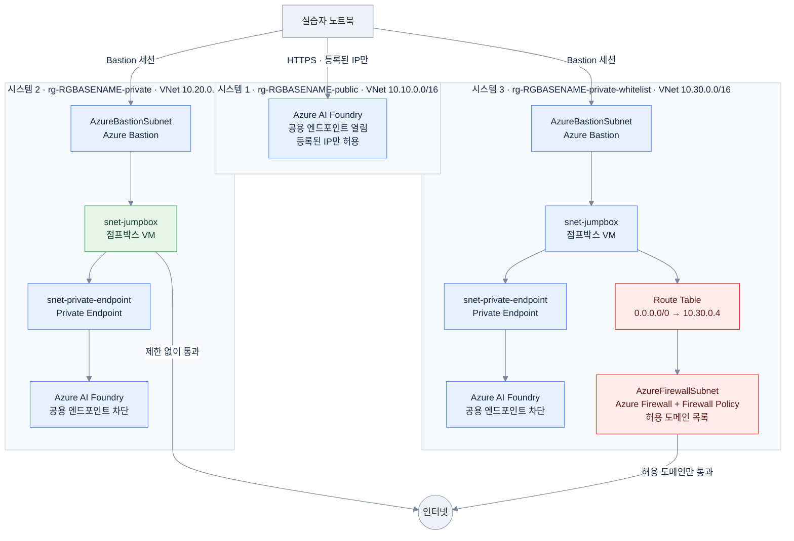
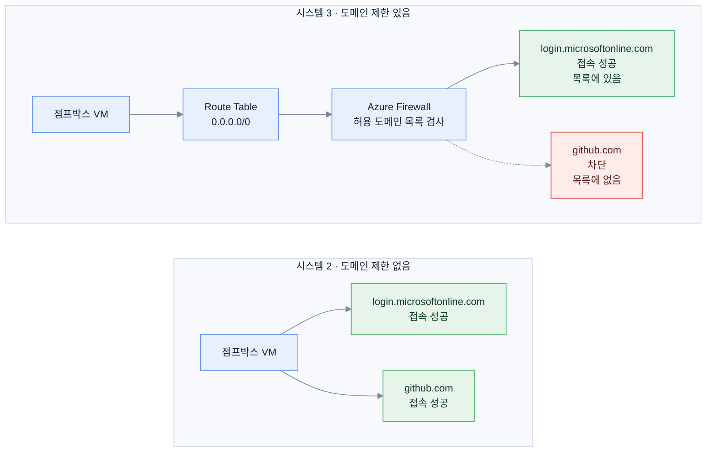

# IaC — Azure AI Foundry HOL

이 디렉터리는 **서로 독립적인 세 개의 시스템**으로 구성돼 있습니다.
각 시스템은 자기 리소스 그룹만 만들고, 자기 진입점(`main.bicep`)을 가지며,
**다른 시스템의 리소스를 참조하지 않습니다.** 따라서 배포 순서를 지킬 필요가 없습니다.

| 시스템 | 리소스 그룹 | 만드는 리소스 | 다른 시스템 의존 |
|---|---|---|---|
| [`public/`](public/) | `rg-<RGBASENAME>-public` | VNet, Foundry(공용 접근 + 허용 IP 제한), 모델 배포, 역할 할당 | **없음** |
| [`private/`](private/) | `rg-<RGBASENAME>-private` | VNet, NSG, Bastion, 점프박스 VM, Foundry(공용 접근 차단) + Private Endpoint + Private DNS | **없음** |
| [`private-whitelist/`](private-whitelist/) | `rg-<RGBASENAME>-private-whitelist` | private과 같은 리소스 + Route Table + Firewall Policy + Azure Firewall | **없음** |



`PE`는 Private Endpoint의 약자입니다.
시스템 2의 점프박스(초록색)는 인터넷으로 바로 나가고,
시스템 3은 Route Table과 방화벽(빨간색)을 거쳐야만 나갈 수 있습니다.

**시스템 2와 시스템 3의 차이는 세 가지입니다.**

1. VNet 안에 방화벽용 서브넷(`AzureFirewallSubnet`, `AzureFirewallManagementSubnet`)을 함께 만듭니다
2. 점프박스 서브넷에 Route Table을 연결해, 외부로 나가는 모든 트래픽(`0.0.0.0/0`)을 방화벽으로 보냅니다
3. Firewall Policy(허용 도메인 목록)와 Azure Firewall을 배포합니다

그 외의 구성(NSG 기본 차단 규칙, 공용 접근을 막은 Foundry, Bastion, 점프박스 VM, 역할 할당)은
**같은 공통 모듈** `modules/workload/private-foundry-workload.bicep`을 사용합니다.
같은 내용을 양쪽에 복사해 두면 한쪽만 수정했을 때 보안 설정이 서로 어긋나기 때문입니다.
두 시스템의 차이는 이 모듈의 매개변수 **2개**(`platformSubnets`, `jumpboxRouteTableId`)로만 표현됩니다.

---

## 배포

```bash
az login
export RGBASENAME=hol01
export REGION=westus3
```

`RGBASENAME`은 리소스 그룹 이름에 들어가는 값이고, `REGION`은 배포할 Azure 리전입니다.

### 시스템 1 — Public

```bash
az deployment sub create -n $RGBASENAME-public -l $REGION \
  --template-file iac/public/main.bicep \
  --parameters resourceGroupBaseName=$RGBASENAME location=$REGION \
               labClientIpAddress="$(curl -s ifconfig.me)" \
               labUserPrincipalId="$(az ad signed-in-user show --query id -o tsv)"
```

### 시스템 2 — Private (아웃바운드 도메인 제한 없음)

```bash
az deployment sub create -n $RGBASENAME-private -l $REGION \
  --template-file iac/private/main.bicep \
  --parameters resourceGroupBaseName=$RGBASENAME location=$REGION \
               labUserPrincipalId="$(az ad signed-in-user show --query id -o tsv)" \
               vmAdminPassword='<12자 이상 복잡한 비밀번호>'
```

점프박스 VM에는 Bastion으로 접속합니다. VM에서 외부로 나가는 트래픽은 NSG가
IP 대역과 포트 수준까지만 확인하고 인터넷으로 바로 나갑니다.

### 시스템 3 — Private + 아웃바운드 도메인 제한

```bash
az deployment sub create -n $RGBASENAME-private-whitelist -l $REGION \
  --template-file iac/private-whitelist/main.bicep \
  --parameters resourceGroupBaseName=$RGBASENAME location=$REGION \
               labUserPrincipalId="$(az ad signed-in-user show --query id -o tsv)" \
               vmAdminPassword='<12자 이상 복잡한 비밀번호>'
```

배포가 끝나면 반드시 확인합니다.

```bash
az deployment sub show -n $RGBASENAME-private-whitelist \
  --query properties.outputs.FIREWALL_ROUTE_IS_VALID.value
# true 여야 합니다. false 이면 Route Table에 설정한 주소와 실제 방화벽 IP가 다른 상태입니다.
```

### Azure Developer CLI(azd)로 배포하기

각 시스템 디렉터리가 독립된 azd 프로젝트입니다. 해당 폴더로 이동해 실행합니다.

```bash
cd iac/private && azd env new hol01 && azd env set VM_ADMIN_PASSWORD '<비밀번호>' && azd up
cd ../private-whitelist && azd env new hol01 && azd env set VM_ADMIN_PASSWORD '<비밀번호>' && azd up
```

---

## 허용 도메인만 바꿔서 다시 배포하기

시스템 3을 매개변수만 바꿔 다시 배포합니다.
방화벽과 정책만 갱신되고 VNet, VM, Foundry는 그대로 유지됩니다.

```bash
az deployment sub create -n $RGBASENAME-private-whitelist -l $REGION \
  --template-file iac/private-whitelist/main.bicep \
  --parameters resourceGroupBaseName=$RGBASENAME location=$REGION \
               vmAdminPassword='<처음 배포할 때와 같은 비밀번호>' \
               additionalAllowedFqdns='["github.com","*.githubusercontent.com"]'
```

허용 목록은 `iac/private-whitelist/main.bicep`의 매개변수로 나뉘어 있습니다 —
`identityAndManagementFqdns` / `foundryFqdns` / `portalFqdns` / `toolingFqdns` /
`additionalAllowedFqdns` / `allowedServiceTags` / `allowedFqdnTags`.

---

## 공통 모듈

`iac/modules/` 는 세 시스템이 함께 사용하는 재사용 단위입니다.
**시스템은 나누되 모듈까지 복사하지는 않았습니다.** NSG 기본 차단 규칙이나 Foundry의 인증 설정 같은
보안 기준이 시스템마다 달라지는 것을 막기 위해서입니다.

```
modules/
├── network/    nsg, vnet, route-table, firewall-policy, firewall, bastion,
│               private-dns-zone, private-endpoint
├── ai/         foundry-account, foundry-project, model-deployments
├── compute/    jumpbox
├── identity/   role-definitions, foundry-role-assignments
├── monitor/    log-analytics
├── governance/ subnet-nsg-policy, policy-assignment
└── workload/   private-foundry-workload   ← private / private-whitelist 공통 구성
```

`workload/private-foundry-workload.bicep`은 리소스 하나가 아니라 **여러 리소스를 한 번에 만드는
모듈(composite module)** 입니다. VNet, NSG, Bastion, 점프박스 VM, Foundry(Private Endpoint와 DNS 포함),
역할 할당을 함께 만들며, 시스템 2와 시스템 3이 이 모듈을 공유합니다.

---

## 설계 결정과 이유

### 시스템 2와 3을 "기본 + 추가"가 아니라 독립된 두 시스템으로 나눈 이유

이전 구조에서는 private 시스템이 방화벽용 서브넷과 Route Table을 미리 만들어 두고,
별도의 whitelist 시스템이 그 서브넷에 방화벽을 배포하는 방식이었습니다. 여기에는 두 가지 문제가 있었습니다.

- private 시스템만 배포하면 Route Table이 아직 존재하지 않는 방화벽 IP를 가리키게 됩니다.
  그러면 점프박스에서 나가는 트래픽이 갈 곳을 잃어 **아웃바운드 통신이 전부 실패**합니다.
- private 시스템의 `deployFirewallManagementSubnet`과 whitelist 시스템의 `firewallSkuTier`를
  **사람이 직접 맞춰야** 했습니다. 한쪽만 바꾸면 배포가 실패합니다.

지금은 두 시스템이 각각 완결된 구성입니다. private 시스템은 방화벽 관련 리소스를 전혀 만들지 않고,
private-whitelist 시스템은 방화벽까지 자기가 모두 만듭니다.
서로를 참조하지 않으므로 배포 순서도, 맞춰야 할 설정도 없습니다.
대신 **두 시스템을 같은 구독에 동시에 배포해 비교**하는 실습이 가능해졌습니다.

### NSG는 VNet과 함께 만들고, 예외는 방화벽 서브넷 두 개뿐

NSG를 먼저 만든 뒤, VNet을 만들 때 서브넷 정의 안에 NSG를 연결합니다.
따라서 "NSG가 연결되지 않은 서브넷"이 잠시라도 존재하는 구간이 없습니다.

규칙을 강제하는 장치는 두 가지입니다.

- `modules/network/vnet.bicep`의 `subnetConfig` 타입이 `networkSecurityGroupId`를 **필수 필드**로
  선언해, NSG를 빠뜨리면 컴파일 단계에서 오류가 납니다.
- `modules/governance/subnet-nsg-policy.bicep`의 Azure Policy가, 배포 이후 포털이나 CLI로
  NSG 없는 서브넷을 추가하는 것을 검사합니다.
  기본값은 `Audit`(위반 사항 기록)입니다. 처음부터 `Deny`로 두면 정책 평가 시점 때문에
  첫 배포 자체가 실패할 수 있어서, 한 번 배포한 뒤 올리는 것을 권장합니다.

단, `AzureFirewallSubnet`과 `AzureFirewallManagementSubnet`은 Azure 플랫폼이 **NSG 연결 자체를
지원하지 않습니다.** 이 두 개가 유일한 예외이며, `SUBNETS_WITHOUT_NSG` 출력값으로 항상 드러납니다.
방화벽이 없는 private 시스템에서는 이 출력값이 **비어 있어야** 정상입니다.
`AzureBastionSubnet`은 반대로 NSG가 **필수**여서, Microsoft 문서에 명시된 필수 규칙 8개를 모두 넣었습니다.

### NSG는 라우팅 결과가 아니라 패킷의 원래 목적지를 봅니다

Route Table로 `0.0.0.0/0`을 방화벽에 보내더라도, NSG 규칙은 패킷에 적힌 **원래 목적지**를 기준으로
평가됩니다. 즉 "방화벽 서브넷으로 나가는 트래픽 허용"만 넣어서는 인터넷 트래픽이 통과하지 못합니다.
점프박스 NSG가 `Internet` 대상 80/443 포트를 넓게 허용하고, 실제 도메인 제한은 방화벽이 맡는 이유입니다.

**NSG는 IP 대역과 포트, 방화벽은 도메인** — 역할이 다릅니다.

### Route Table의 다음 홉 주소를 미리 계산한 이유

VNet → Firewall → Route Table → VNet 으로 이어지는 순환 참조를 피하기 위해,
`cidrHost(firewallSubnetPrefix, 3)` 으로 방화벽이 받을 IP를 미리 계산합니다.

Azure Firewall은 전용 서브넷에서 항상 사용 가능한 첫 번째 주소(`x.x.x.4`)를 할당받습니다
(`.0`은 네트워크 주소, `.1`은 게이트웨이, `.2`와 `.3`은 Azure 예약 주소).
덕분에 하나의 시스템 안에서 Route Table → VNet → Firewall 순서로 문제없이 배포됩니다.
계산한 주소와 실제 할당된 주소가 같은지는 `FIREWALL_ROUTE_IS_VALID` 출력값으로 확인합니다.

### AzureBastionSubnet에는 Route Table을 연결하지 않았습니다

`0.0.0.0/0`을 방화벽으로 보내면 Bastion의 제어 트래픽이 끊겨 세션이 열리지 않습니다.
의도적으로 제외했습니다.

### DNS는 Azure가 제공하는 기본 DNS를 사용합니다

Azure Firewall의 DNS 프록시 기능을 켜면 VNet의 DNS 서버를 방화벽 IP로 바꿔야 합니다.
Private Endpoint의 이름 해석은 VNet에 연결된 Private DNS Zone만으로 충분하고,
도메인 기반 필터링도 **애플리케이션 규칙**에서는 DNS 프록시 없이 동작하므로 켜지 않았습니다.
네트워크 규칙에 도메인을 직접 쓸 때만 필요합니다.

### Private Endpoint 서브넷에 `privateEndpointNetworkPolicies=Enabled`를 준 이유

이 설정의 기본값은 `Disabled`이며, 그 상태에서는 Private Endpoint로 향하는 트래픽에 NSG가 적용되지 않습니다.
기본 차단 규칙을 Private Endpoint에도 실제로 적용하기 위해 `Enabled`로 두고,
점프박스 서브넷에서 오는 443 포트만 명시적으로 허용했습니다.

### Azure Firewall Basic SKU의 추가 요구사항

Basic SKU는 `AzureFirewallManagementSubnet`과 **별도의 공용 IP**를 요구합니다.
둘 다 private-whitelist 시스템이 `firewallSkuTier` 값에 따라 알아서 만듭니다 —
다른 시스템과 설정을 맞출 필요가 없습니다. Standard나 Premium으로 바꾸면 관리용 서브넷 없이 배포됩니다.

### 모델 선택 — `gpt-4.x` 계열은 사용할 수 없습니다

`az cognitiveservices model list` 결과에 나온다고 해서 배포할 수 있는 것은 아닙니다.
이 목록에는 **지원 종료 예정(Deprecating) 상태인 모델도 함께 나오는데**,
이런 모델은 배포 전 검사 단계에서 거부됩니다.

```
ServiceModelDeprecating - The model 'Format:OpenAI,Name:gpt-4.1-mini,Version:2025-04-14'
is in deprecating state and cannot be used for new deployments.
```

`gpt-4o`, `gpt-4o-mini`, `gpt-4.1`, `gpt-4.1-mini`, `gpt-4.1-nano` 모두 해당합니다.
기본값을 `gpt-5.4-mini`(2026-03-17, 정식 출시 상태)로 잡은 이유입니다.
모델을 바꿀 때는 아래 명령으로 상태를 먼저 확인하세요.

```bash
az cognitiveservices model list -l westus3 \
  --query "[?model.name=='<모델명>'].{v:model.version, ls:model.lifecycleStatus, s:join(',',model.skus[].name)}" -o table
```

### Log Analytics는 시스템마다 따로 만듭니다

시스템 간 독립성을 지키기 위해, 각 시스템이 자기 작업 영역을 선택적으로 만듭니다.
private-whitelist 시스템만 기본값이 `true`입니다 — 무엇이 차단됐는지 확인할 수 없으면
도메인 제한 실습이 성립하지 않기 때문입니다.
하나로 합치고 싶다면 `existingLogAnalyticsWorkspaceId`에 기존 작업 영역의 리소스 ID를 넘기면 됩니다.
일일 수집량 상한은 1GB로 제한해 두었습니다.

### `bicepconfig.json`에서 `no-hardcoded-env-urls` 규칙을 끈 이유

이 린터 규칙은 소스에 Azure URL을 직접 적는 것을 경고합니다.
하지만 이 프로젝트의 허용 도메인 목록은 `login.microsoftonline.com` 같은 도메인을
**문자열 그대로 적는 것이 목적**입니다. 대신 `no-unused-params` 같은 실질적인 규칙은 `error`로 올렸습니다.

---

## 실습 시나리오

### 1. Public 망 — 노트북에서 API 키 없이 호출

```python
from azure.identity import DefaultAzureCredential, get_bearer_token_provider
from openai import AzureOpenAI

token_provider = get_bearer_token_provider(
    DefaultAzureCredential(), "https://cognitiveservices.azure.com/.default"
)
client = AzureOpenAI(
    azure_endpoint="<PUBLIC_FOUNDRY_ENDPOINT>",
    azure_ad_token_provider=token_provider,   # api_key 를 넘기지 않습니다
    api_version="2024-10-21",
)
print(client.chat.completions.create(
    model="gpt-5.4-mini",
    messages=[{"role": "user", "content": "안녕"}],
).choices[0].message.content)
```

API 키가 아예 발급되지 않습니다. `disableLocalAuth=true` 설정 때문에
`az cognitiveservices account keys list` 명령도 실패합니다.
노트북을 다른 네트워크로 옮기면 허용 IP 목록에서 벗어나 `403` 오류가 납니다.

### 2. Private 망 — 노트북에서는 실패해야 정상

같은 코드로 `PRIVATE_FOUNDRY_ENDPOINT`를 호출하면 실패합니다.
공용 엔드포인트가 닫혀 있어서(`publicNetworkAccess=Disabled`) 인터넷 경로가 없기 때문입니다.

### 3. Private 망 — Bastion으로 접속해 호출 성공

```bash
az network bastion rdp --name <BASTION_NAME> --resource-group rg-$RGBASENAME-private \
  --target-resource-id $(az vm show -g rg-$RGBASENAME-private -n <JUMPBOX_NAME> --query id -o tsv)
```

```powershell
nslookup <foundry 계정명>.openai.azure.com   # 10.20.1.x 대역 사설 IP가 반환되면 정상
```

`DefaultAzureCredential()`이 VM에 할당된 관리 ID를 자동으로 사용하므로, 코드에 키를 넣지 않아도 호출됩니다.

### 4. 아웃바운드 도메인 제한 비교 — 시스템 2 vs 시스템 3

같은 명령을 두 점프박스에서 각각 실행합니다. **결과 차이가 곧 방화벽의 효과입니다.**



```powershell
Invoke-WebRequest https://login.microsoftonline.com
Invoke-WebRequest https://github.com
```

| | 시스템 2 (private) | 시스템 3 (private-whitelist) |
|---|---|---|
| `login.microsoftonline.com` | 성공 | 성공 (허용 목록에 있음) |
| `github.com` | **성공** — 제한이 없습니다 | **실패** — 허용 목록에 없습니다 |

시스템 3에서 차단된 기록은 Log Analytics에서 확인합니다.

```kusto
AZFWApplicationRule
| where TimeGenerated > ago(30m)
| project TimeGenerated, SourceIp, Fqdn, Action, Rule
| order by TimeGenerated desc
```

`additionalAllowedFqdns`에 `github.com`을 추가하고 시스템 3만 다시 배포하면 접속이 허용됩니다.

### 5. NSG 정책 준수 여부 확인

```bash
az policy state list --resource-group rg-$RGBASENAME-private \
  --filter "policyDefinitionName eq 'policy-subnet-requires-nsg-$RGBASENAME-private'" \
  --query "[].{res:resourceId, state:complianceState}" -o table
```

---

## 비용

westus3 리전 기준 소매가입니다(USD, 2026-08 Azure Retail Prices API 조회값).
사용하지 않아도 계속 부과되는 항목만 정리했습니다.

| 시스템 | 리소스 | 시간당 |
|---|---|---|
| private-whitelist | Firewall Basic($0.395/h + 처리량 $0.065/GB) + 공용 IP 2개 + Bastion Basic($0.19/h) + 점프박스 D2s_v5 Windows($0.188/h) | **약 $0.79** |
| private | Bastion Basic($0.19/h) + 점프박스 D2s_v5 Windows($0.188/h) + 공용 IP | **약 $0.38** |
| public | VNet/NSG/Foundry — 사용하지 않으면 요금 없음 | **약 $0** |
| | **세 시스템을 모두 켜 둘 때 합계** | **약 $1.17/시간** |

- 비교 실습이 끝났다면 **시스템 3만 삭제해도 시간당 약 $0.79가 절약됩니다.**
- Azure Firewall **Standard**는 $1.25/h + 용량 단위 $0.07/h로 Basic보다 3배 이상 비쌉니다.
- Foundry 모델 호출 요금은 토큰 사용량 기준이며 위 표와 별개입니다.

---

## 리소스 정리

시스템 간 의존 관계가 없으므로 삭제 순서는 상관없습니다.

```bash
az group delete -n rg-$RGBASENAME-private-whitelist --yes --no-wait
az group delete -n rg-$RGBASENAME-private           --yes --no-wait
az group delete -n rg-$RGBASENAME-public            --yes --no-wait

# Foundry 계정은 삭제 후에도 일정 기간 보관(soft delete)되므로, 같은 이름을 다시 쓰려면 완전 삭제(purge)해야 합니다.
az cognitiveservices account list-deleted -o table
az cognitiveservices account purge -n <계정명> -l <리전> -g <리소스 그룹>

# 두 시스템이 구독 범위에 만든 정책 정의와 할당 삭제
for STACK in private private-whitelist; do
  az policy assignment delete -n assign-subnet-requires-nsg-$RGBASENAME-$STACK \
    --scope /subscriptions/<구독 ID>/resourceGroups/rg-$RGBASENAME-$STACK
  az policy definition delete -n policy-subnet-requires-nsg-$RGBASENAME-$STACK
done
```

---

## 검증 상태

westus3 리전에서 `resourceGroupBaseName=holv3`으로 실행한 결과입니다.

| 항목 | public | private | private-whitelist |
|---|---|---|---|
| `az bicep build` (경고·오류 0건) | 통과 | 통과 | 통과 |
| `az deployment sub validate` | 통과 | 통과 | 통과 |
| `az deployment sub what-if` | 생성 6건 | 생성 22건 | 생성 37건 |

`what-if` 결과에서 직접 확인한 내용입니다.

- 각 시스템이 **자기 리소스 그룹 하나만** 변경합니다
  (`rg-holv3-public` / `rg-holv3-private` / `rg-holv3-private-whitelist`)
- private 시스템에는 방화벽과 Route Table 관련 리소스가 **0건**입니다.
  서브넷도 3개(`AzureBastionSubnet`, `snet-private-endpoint`, `snet-jumpbox`)뿐이며
  **모두 NSG가 연결돼 있고 Route Table은 없습니다**
- private-whitelist 시스템은 `AzureFirewallSubnet`(10.30.0.0/26)과
  `AzureFirewallManagementSubnet`(10.30.0.64/26)을 자기 VNet에 만들고,
  `snet-jumpbox`에 `default-to-firewall 0.0.0.0/0 → VirtualAppliance 10.30.0.4` 경로를 연결합니다
- 두 시스템의 NSG와 Foundry 이름이 서로 다릅니다
  (`nsg-holv3-private-*` ↔ `nsg-holv3-private-whitelist-*`) — 같은 구독에 동시 배포할 수 있습니다

**아직 검증하지 못한 것:**

- **실제 배포는 하지 않았습니다.** 방화벽과 Bastion 프로비저닝에 20~30분이 걸리고 그 시점부터 요금이 발생합니다.
- 방화벽에 실제 할당되는 사설 IP가 계산값(`10.30.0.4`)과 같은지는 실제 배포 후
  `FIREWALL_ROUTE_IS_VALID` 출력값으로 확인해야 합니다.
