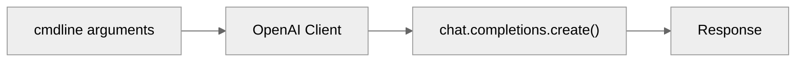
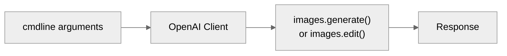
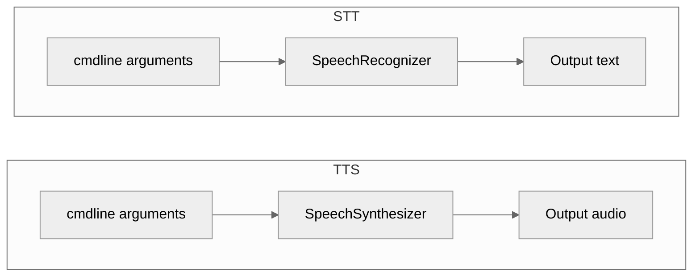
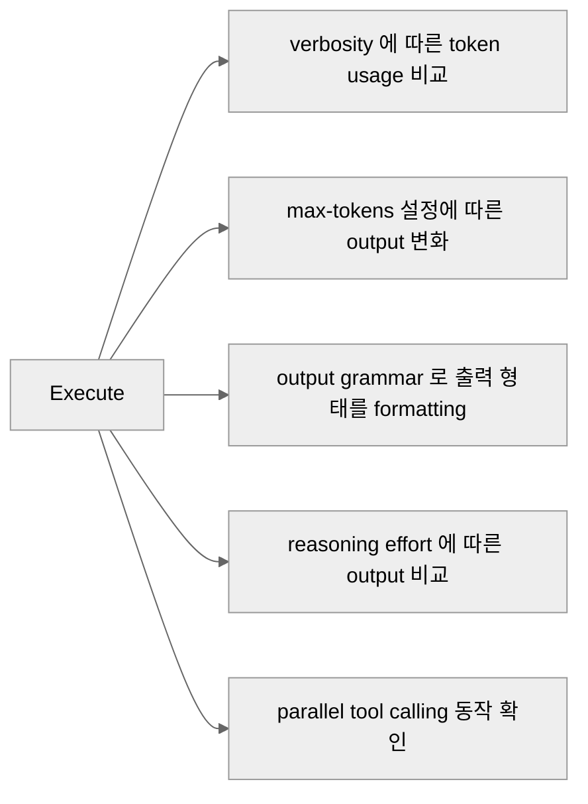
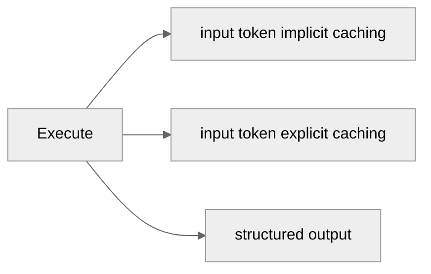

# Overview

Foundry 을 CLI에서 직접 호출해 보는 hands-on 스크립트 collection 입니다.

# Prerequisite
- Microsoft Foundry workspace ・ project ・ 모델 배포 완료
- 아래 명령어 실행하여 python package dependency resolve
  ```bash
  pip install -r requirements.txt
  az login
  ```

## 공통 인증

이 랩의 Foundry 계정은 키를 꺼 두었기 때문에(`disableLocalAuth=true`) 기본 경로는 Entra ID
토큰입니다. `az login`만 해 두면 아무 인증 인자도 줄 필요가 없습니다.
인증 코드는 [`identity.py`](identity.py) 한 곳에 있고, 아래 인자는 모든 스크립트가 공유합니다.

| 인자 | 기본값 | 설명 |
|---|---|---|
| `--auth` | `default` | `default` · `cli` · `device-code` · `environment` · `managed-identity` · `client-secret` · `client-certificate` · `api-key` · `access-token` |
| `--tenant-id` | `$AZURE_TENANT_ID` | 서비스 주체·디바이스 코드에서 사용 |
| `--client-id` | `$AZURE_CLIENT_ID` | 서비스 주체, 또는 사용자 할당 관리 ID |
| `--client-secret` | `$AZURE_CLIENT_SECRET` | `--auth client-secret` |
| `--certificate-path` | `$AZURE_CLIENT_CERTIFICATE_PATH` | `--auth client-certificate` |
| `--api-key` | `$AZURE_OPENAI_API_KEY` | 키를 끈 계정에서는 401 |
| `--access-token` | `$AZURE_OPENAI_ACCESS_TOKEN` | 이미 받아 둔 토큰 |

## Foundry Models
Foundry 의 **모델 호출(`hol-foundry-models-*.py`)** 을 다룹니다.

| File name | What to do |
|---|---|
| [`hol-foundry-models-llm.py`](#hol-foundry-models-llmpy) | LLM Q&A Pipeline |
| [`hol-foundry-models-optimize-reasoning.py`](#hol-foundry-models-optimize-reasoningpy) | LLM 추론·출력량 조절 옵션 비교 |
| [`hol-foundry-models-optimize-token.py`](#hol-foundry-models-optimize-tokenpy) | LLM 프롬프트 캐시와 구조화 출력으로 토큰 줄이기 |
| [`hol-foundry-models-vlm.py`](#hol-foundry-models-vlmpy) | Image 생성·편집 |
| [`hol-foundry-models-stt_tts.py`](#hol-foundry-models-stt_ttspy) | 음성 합성(TTS), 음성 인식(STT) |

### hol-foundry-models-llm.py

시스템 · 사용자 프롬프트를 보내고 응답을 받습니다.



| 인자 | 기본값 | 설명 |
|---|---|---|
| `--endpoint` | (필수) | Foundry Azure OpenAI 엔드포인트 |
| `--deployment` | `gpt-5.4` | 모델 Deployment 이름 |
| `--system` | `You are a helpful assistant.` | System 프롬프트 |
| `--user` | (필수) | User 프롬프트 |
| `--temperature` | 모델 default | |
| `--max-tokens` | 모델 default | |
| `--stream` | false | streaming 방식으로 token 수신 |

```bash
python hol-foundry-models-llm.py \
  --endpoint "<foundry-aoai-endpoint>" \
  --deployment "<model-deployment-name>" \
  --user "Azure Private Endpoint 를 세 문장으로 설명해줘."
```

---

### hol-foundry-models-vlm.py

텍스트 프롬프트와 이미지를 보내고 응답을 받습니다.



| 인자 | 기본값 | 설명 |
|---|---|---|
| `--endpoint` | (필수) | Foundry Azure OpenAI 엔드포인트 |
| `--deployment` | `gpt-image-2` | 모델 Deployment 이름 |
| `--method` | `generate` | `generate` 또는 `edit` |
| `--prompt` / `--prompt-file` | (둘 중 하나 필수) | 프롬프트를 직접 주거나 텍스트 파일에서 읽기 |
| `--image` | — | `--method edit`의 원본 이미지 |
| `--mask` | — | 교체할 영역을 표시한 PNG |
| `--out` | `image.png` | 출력 파일 |
| `--size` | `1024x1024` | |
| `--quality` | `low` | `low` · `medium` · `high` |
| `--count` | `1` | 받을 이미지 개수 |

```bash
# 생성 : 기본
python hol-foundry-models-vlm.py \
  --endpoint "<foundry-aoai-endpoint>" \
  --deployment "<model-deployment-name>" \
  --prompt "겨울 산 위의 데이터센터, 수채화" \
  --out datacenter.png

# 생성 : prompt 파일
python hol-foundry-models-vlm.py \
  --endpoint "<foundry-aoai-endpoint>" \
  --deployment "<model-deployment-name>" \
  --prompt-file assets/models/creative-01.txt \
  --quality high --count 2

# 편집
python hol-foundry-models-vlm.py \
  --endpoint "<foundry-aoai-endpoint>" \
  --deployment "<model-deployment-name>" \
  --method edit \
  --prompt-file assets/models/style-prompt.txt \
  --image assets/models/style-001.jpg
```

---

### hol-foundry-models-stt_tts.py

Azure Speech로 텍스트를 소리로(TTS), 소리를 텍스트로(STT) 바꿉니다.
`--tts-input`과 `--stt-input` 중 **정확히 하나**만 줍니다.



| 인자 | 기본값 | 설명 |
|---|---|---|
| `--endpoint` | (필수) | Foundry Speech 엔드포인트 |
| `--tts-input` | — | Text-to-Speech 입력 텍스트 |
| `--tts-output` | `speech.wav` | Text-to-Speech 출력 파일 |
| `--tts-voice` | `en-US-Ava:DragonHDLatestNeural` | voice 타입 |
| `--stt-input` | — | Speech-to-Text 입력 파일 |
| `--stt-lang` | `ko-KR` | Speech-to-Text 입력 언어 |
| `--stt-phrase` | — | 입력 단어 phrase list |
| `--stt-silence-ms` | SDK default | input 무음 구간 |
| `--stt-detailed` | 끔 | confidence 를 비롯한 세부사항을 출력 |
| `--stt-any-format` | 끔 | 16 kHz 모노가 아닌 파일도 그대로 전송 |
| `--no-post-refine` | 끔 | TrueText 후처리 끔 |

```bash
# STT — 한국어 음성으로
python hol-foundry-models-stt_tts.py \
  --endpoint "<foundry-aoai-endpoint>" \
  --stt-input "assets/models/갤럭시Z 폴드8·플립8, 내일부터 사전 판매@2026.07.27.wav"

# TTS — STT 로 출력된 텍스트 되받아 적기
python hol-foundry-models-stt_tts.py \
  --endpoint "<foundry-aoai-endpoint>" \
  --tts-input "..."
```

---

### hol-foundry-models-optimize-reasoning.py

Responses API의 조절 옵션을 하나씩 실행하고, 그때마다 `usage`를 찍어 줍니다.
무엇이 얼마나 토큰을 쓰는지 눈으로 보는 것이 목적입니다.



| 인자 | 기본값 | 설명 |
|---|---|---|
| `--endpoint` | (필수) | Foundry Azure OpenAI 엔드포인트 |
| `--deployment` | `gpt-5.4` | 모델 Deployment 이름 |
| `--demo` | `all` | `verbosity` · `max-tokens` · `cfg` · `reasoning` · `parallel-tools` · `all` |

```bash
# 다섯 개 전부
python hol-foundry-models-optimize-reasoning.py \
  --endpoint "<foundry-aoai-endpoint>" \
  --deployment "<model-deployment-name>"
```

---

### hol-foundry-models-optimize-token.py

프롬프트 캐시가 실제로 걸리는지, 그리고 구조화 출력이 모델마다 몇 토큰을 쓰는지 재 봅니다.



| 인자 | 기본값 | 설명 |
|---|---|---|
| `--endpoint` | (필수) | Foundry Azure OpenAI 엔드포인트 |
| `--deployment` | `gpt-5.4` | 모델 Deployment 이름 |
| `--demo` | `all` | `caching` · `cache-retention` · `cache-key` · `structured` · `all` |
| `--rounds` | `10` | input token caching 반복 횟수 |
| `--cache-key` | `prompt-cache-key-1` | 요청을 한 엔드포인트에 붙여 두는 키 |
| `--structured-deployments` | `gpt-4.1 gpt-5.4` | 같은 구조화 출력으로 비교할 모델 Deployment 들 |

```bash
# 전부
python hol-foundry-models-optimize-token.py \
  --endpoint "<foundry-aoai-endpoint>" \
  --deployment "<model-deployment-name>"
```