# Overview

Foundry 을 CLI에서 직접 호출해 보는 hands-on 스크립트 collection 입니다.

# Prerequisite
- Microsoft Foundry workspace ・ project ・ 모델 배포 완료
- 아래 명령어 실행하여 python package dependency resolve
  ```bash
  pip install -r requirements.txt
  az login
  ```

## 공통 인증

이 랩의 Foundry 계정은 키를 꺼 두었기 때문에(`disableLocalAuth=true`) 기본 경로는 Entra ID
토큰입니다. `az login`만 해 두면 아무 인증 인자도 줄 필요가 없습니다.
인증 코드는 [`identity.py`](identity.py) 한 곳에 있고, 아래 인자는 모든 스크립트가 공유합니다.

| 인자 | 기본값 | 설명 |
|---|---|---|
| `--auth` | `default` | `default` · `cli` · `device-code` · `environment` · `managed-identity` · `client-secret` · `client-certificate` · `api-key` · `access-token` |
| `--tenant-id` | `$AZURE_TENANT_ID` | 서비스 주체·디바이스 코드에서 사용 |
| `--client-id` | `$AZURE_CLIENT_ID` | 서비스 주체, 또는 사용자 할당 관리 ID |
| `--client-secret` | `$AZURE_CLIENT_SECRET` | `--auth client-secret` |
| `--certificate-path` | `$AZURE_CLIENT_CERTIFICATE_PATH` | `--auth client-certificate` |
| `--api-key` | `$AZURE_OPENAI_API_KEY` | 키를 끈 계정에서는 401 |
| `--access-token` | `$AZURE_OPENAI_ACCESS_TOKEN` | 이미 받아 둔 토큰 |

## Foundry Models
Foundry 의 **모델 호출(`hol-foundry-models-*.py`)** 을 다룹니다.

| File name | What to do |
|---|---|
| [`hol-foundry-models-llm.py`](#hol-foundry-models-llmpy) | LLM Q&A Pipeline |
| [`hol-foundry-models-optimize-reasoning.py`](#hol-foundry-models-optimize-reasoningpy) | LLM 추론·출력량 조절 옵션 비교 |
| [`hol-foundry-models-optimize-token.py`](#hol-foundry-models-optimize-tokenpy) | LLM 프롬프트 캐시와 구조화 출력으로 토큰 줄이기 |
| [`hol-foundry-models-vlm.py`](#hol-foundry-models-vlmpy) | Image 생성·편집 |
| [`hol-foundry-models-stt_tts.py`](#hol-foundry-models-stt_ttspy) | 음성 합성(TTS), 음성 인식(STT) |

### hol-foundry-models-llm.py

시스템 · 사용자 프롬프트를 보내고 응답을 받습니다.

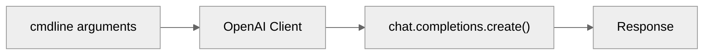

| 인자 | 기본값 | 설명 |
|---|---|---|
| `--endpoint` | (필수) | Foundry Azure OpenAI 엔드포인트 |
| `--deployment` | `gpt-5.4` | 모델 Deployment 이름 |
| `--system` | `You are a helpful assistant.` | System 프롬프트 |
| `--user` | (필수) | User 프롬프트 |
| `--temperature` | 모델 default | |
| `--max-tokens` | 모델 default | |
| `--stream` | false | streaming 방식으로 token 수신 |

```bash
python hol-foundry-models-llm.py \
  --endpoint "<foundry-aoai-endpoint>" \
  --deployment "<model-deployment-name>" \
  --user "Azure Private Endpoint 를 세 문장으로 설명해줘."
```

---

### hol-foundry-models-vlm.py

텍스트 프롬프트와 이미지를 보내고 응답을 받습니다.

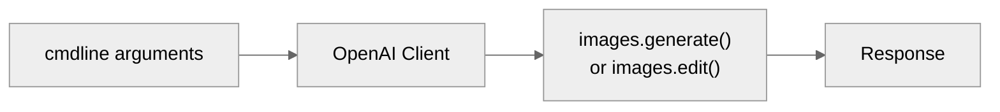

| 인자 | 기본값 | 설명 |
|---|---|---|
| `--endpoint` | (필수) | Foundry Azure OpenAI 엔드포인트 |
| `--deployment` | `gpt-image-2` | 모델 Deployment 이름 |
| `--method` | `generate` | `generate` 또는 `edit` |
| `--prompt` / `--prompt-file` | (둘 중 하나 필수) | 프롬프트를 직접 주거나 텍스트 파일에서 읽기 |
| `--image` | — | `--method edit`의 원본 이미지 |
| `--mask` | — | 교체할 영역을 표시한 PNG |
| `--out` | `image.png` | 출력 파일 |
| `--size` | `1024x1024` | |
| `--quality` | `low` | `low` · `medium` · `high` |
| `--count` | `1` | 받을 이미지 개수 |

```bash
# 생성 : 기본
python hol-foundry-models-vlm.py \
  --endpoint "<foundry-aoai-endpoint>" \
  --deployment "<model-deployment-name>" \
  --prompt "겨울 산 위의 데이터센터, 수채화" \
  --out datacenter.png

# 생성 : prompt 파일
python hol-foundry-models-vlm.py \
  --endpoint "<foundry-aoai-endpoint>" \
  --deployment "<model-deployment-name>" \
  --prompt-file assets/models/creative-01.txt \
  --quality high --count 2

# 편집
python hol-foundry-models-vlm.py \
  --endpoint "<foundry-aoai-endpoint>" \
  --deployment "<model-deployment-name>" \
  --method edit \
  --prompt-file assets/models/style-prompt.txt \
  --image assets/models/style-001.jpg
```

---

### hol-foundry-models-stt_tts.py

Azure Speech로 텍스트를 소리로(TTS), 소리를 텍스트로(STT) 바꿉니다.
`--tts-input`과 `--stt-input` 중 **정확히 하나**만 줍니다.

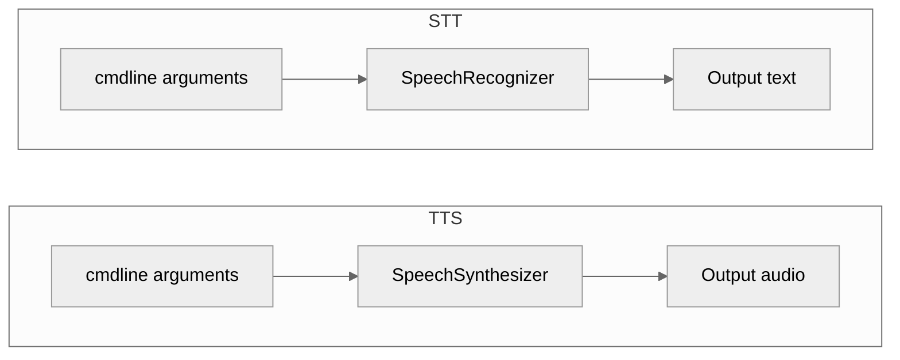

| 인자 | 기본값 | 설명 |
|---|---|---|
| `--endpoint` | (필수) | Foundry Speech 엔드포인트 |
| `--tts-input` | — | Text-to-Speech 입력 텍스트 |
| `--tts-output` | `speech.wav` | Text-to-Speech 출력 파일 |
| `--tts-voice` | `en-US-Ava:DragonHDLatestNeural` | voice 타입 |
| `--stt-input` | — | Speech-to-Text 입력 파일 |
| `--stt-lang` | `ko-KR` | Speech-to-Text 입력 언어 |
| `--stt-phrase` | — | 입력 단어 phrase list |
| `--stt-silence-ms` | SDK default | input 무음 구간 |
| `--stt-detailed` | 끔 | confidence 를 비롯한 세부사항을 출력 |
| `--stt-any-format` | 끔 | 16 kHz 모노가 아닌 파일도 그대로 전송 |
| `--no-post-refine` | 끔 | TrueText 후처리 끔 |

```bash
# STT — 한국어 음성으로
python hol-foundry-models-stt_tts.py \
  --endpoint "<foundry-aoai-endpoint>" \
  --stt-input "assets/models/갤럭시Z 폴드8·플립8, 내일부터 사전 판매@2026.07.27.wav"

# TTS — STT 로 출력된 텍스트 되받아 적기
python hol-foundry-models-stt_tts.py \
  --endpoint "<foundry-aoai-endpoint>" \
  --tts-input "..."
```

---

### hol-foundry-models-optimize-reasoning.py

Responses API의 조절 옵션을 하나씩 실행하고, 그때마다 `usage`를 찍어 줍니다.
무엇이 얼마나 토큰을 쓰는지 눈으로 보는 것이 목적입니다.

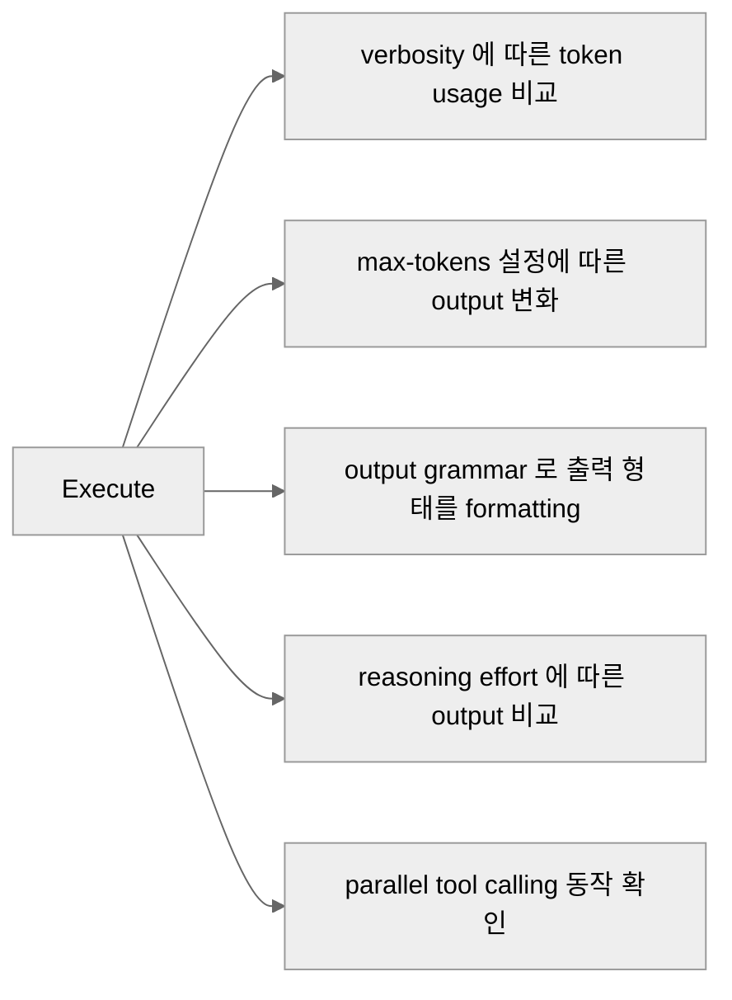

| 인자 | 기본값 | 설명 |
|---|---|---|
| `--endpoint` | (필수) | Foundry Azure OpenAI 엔드포인트 |
| `--deployment` | `gpt-5.4` | 모델 Deployment 이름 |
| `--demo` | `all` | `verbosity` · `max-tokens` · `cfg` · `reasoning` · `parallel-tools` · `all` |

```bash
# 다섯 개 전부
python hol-foundry-models-optimize-reasoning.py \
  --endpoint "<foundry-aoai-endpoint>" \
  --deployment "<model-deployment-name>"
```

---

### hol-foundry-models-optimize-token.py

프롬프트 캐시가 실제로 걸리는지, 그리고 구조화 출력이 모델마다 몇 토큰을 쓰는지 재 봅니다.

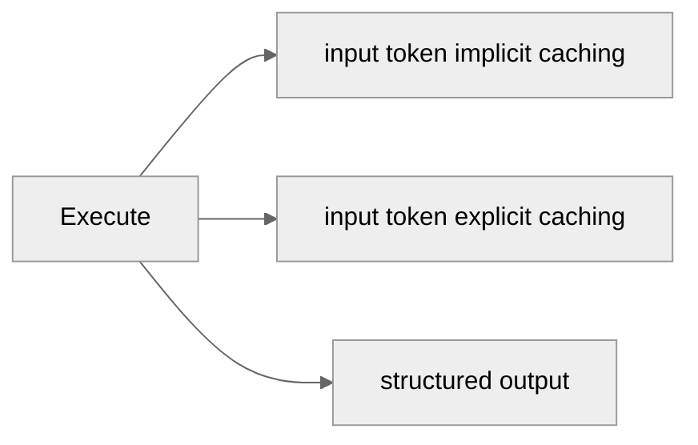

| 인자 | 기본값 | 설명 |
|---|---|---|
| `--endpoint` | (필수) | Foundry Azure OpenAI 엔드포인트 |
| `--deployment` | `gpt-5.4` | 모델 Deployment 이름 |
| `--demo` | `all` | `caching` · `cache-retention` · `cache-key` · `structured` · `all` |
| `--rounds` | `10` | input token caching 반복 횟수 |
| `--cache-key` | `prompt-cache-key-1` | 요청을 한 엔드포인트에 붙여 두는 키 |
| `--structured-deployments` | `gpt-4.1 gpt-5.4` | 같은 구조화 출력으로 비교할 모델 Deployment 들 |

```bash
# 전부
python hol-foundry-models-optimize-token.py \
  --endpoint "<foundry-aoai-endpoint>" \
  --deployment "<model-deployment-name>"
```

## Foundry Agents
Foundry 의 **에이전트(`hol-foundry-agents-*.py`)** 를 다룹니다.
세 스크립트 모두 **markdown 문서 하나를 근거로 답하는 같은 RAG 에이전트**입니다.

| File name | What to do |
|---|---|
| [`hol-foundry-agents-prompt.py`](#hol-foundry-agents-promptpy) | Foundry 에 prompt agent (declarative) 를 만들고 File Search 로 답하기 |
| [`hol-foundry-agents-responses.py`](#hol-foundry-agents-responsespy) | Azure OpenAI Responses API 를 이용한 로컬 Agent 만들기 |
| [`hol-foundry-agents-hosted.py`](#hol-foundry-agents-hostedpy) | Agent Framework 로 만든 hosted agent 로컬 버전 |

### hol-foundry-agents-prompt.py

문서를 업로드해 vector store 로 색인하고, 그 위에 prompt agent 를 선언합니다.
검색도 응답도 전부 서비스에서 일어나므로 이 프로세스는 질문만 던집니다.

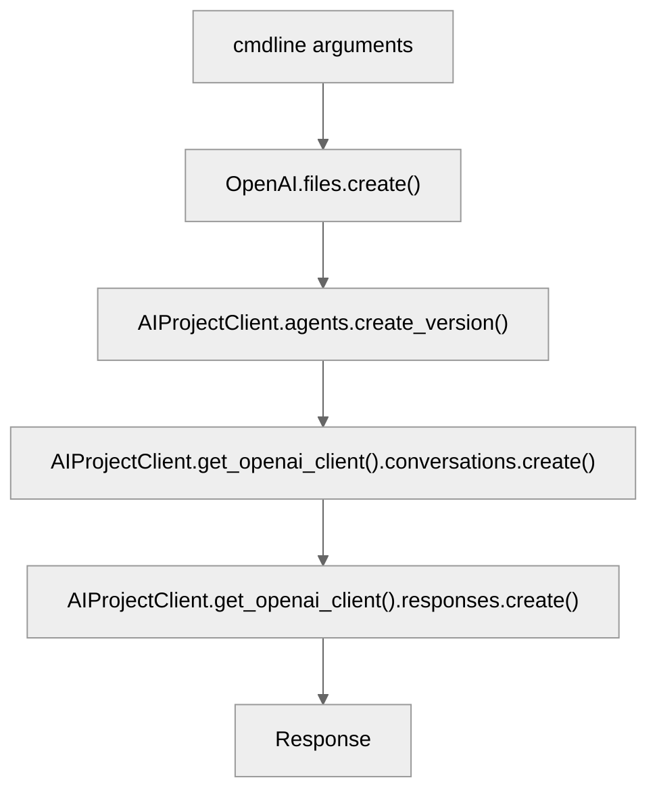

| 인자 | 기본값 | 설명 |
|---|---|---|
| `--endpoint` | (필수) | Foundry project 엔드포인트 |
| `--deployment` | `gpt-5.6-terra` | 모델 Deployment 이름 |
| `--file` | — | 업로드할 파일 |
| `--agent-name` | `hol-md-rag` | Foundry agent 이름 |
| `--question` | (필수) | 질문 |
| `--delete` | 끔 | 끝나고 agent · vector store · file 까지 정리 |

- vector store 색인에는 계정에 **embedding deployment** (`text-embedding-3-large`) 가 있어야 합니다.

```bash
# 최초 실행 : 문서를 올리며 agent 생성
python hol-foundry-agents-prompt.py \
  --endpoint "<foundry-project-endpoint>" \
  --file "assets/tools/KB주택시장리뷰_2025년 10월호.md" \
  --question "2025년 10월 서울 아파트 매매가격 흐름을 요약해줘."

# 재사용 : --file 없이, 이어서 두 번 묻기
python hol-foundry-agents-prompt.py \
  --endpoint "<foundry-project-endpoint>" \
  --question "전세 시장은 어땠어?" \
  --question "그 근거가 된 문장을 그대로 인용해줘."

# 정리 : agent · vector store · file 삭제
python hol-foundry-agents-prompt.py \
  --endpoint "<foundry-project-endpoint>" \
  --question "마지막 질문" \
  --delete
```

---

### hol-foundry-agents-responses.py

로컬 Agent 를 구축하여 OpenAI Responses API 를 사용합니다. Tool calling 시에 RAG pipeline 을 위해 `grep` · `sed` 로 로컬 파일을 읽어 결과를 돌려 줍니다.

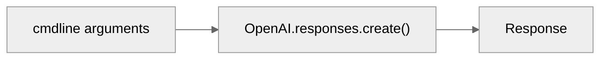

| 인자 | 기본값 | 설명 |
|---|---|---|
| `--endpoint` | (필수) | Foundry project 엔드포인트 |
| `--deployment` | `gpt-5.6-terra` | 모델 Deployment 이름 |
| `--file` | (필수) | 검색할 로컬 markdown |
| `--question` | (필수) | 질문 |
| `--show-tools` | 끔 | 모델이 돌린 검색을 그대로 출력 |

- tool loop 는 최대 8 라운드입니다. 넘으면 질문을 좁히라는 메시지와 함께 종료합니다.
- `subprocess` 를 shell 없이 실행하므로 모델이 만든 패턴이 다른 명령으로 번지지 않습니다.

```bash
# 기본
python hol-foundry-agents-responses.py \
  --endpoint "<foundry-aoai-endpoint>" \
  --file "assets/tools/KB주택시장리뷰_2025년 10월호.md" \
  --question "월세 지수는 어떻게 움직였어?"
```

---

### hol-foundry-agents-hosted.py

앞의 responses 예제와 같은 도구를 Agent Framework 의 `Agent` 로 감싼 것입니다.
파일 하나가 두 가지로 동작합니다 — `--question` 을 주면 한 번 답하고 끝나고,
주지 않으면 responses 프로토콜을 서빙합니다. Foundry 는 이 서빙 경로로 에이전트를 호출합니다.

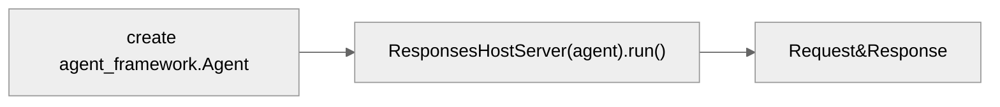

| 인자 | 기본값 | 설명 |
|---|---|---|
| `--endpoint` | `$FOUNDRY_PROJECT_ENDPOINT` · `$AZURE_AI_PROJECT_ENDPOINT` | Foundry project 엔드포인트 |
| `--deployment` | `$FOUNDRY_MODEL_NAME` · `$AZURE_AI_MODEL_DEPLOYMENT_NAME` · `gpt-5.6-terra` | 모델 Deployment 이름 |
| `--file` | `$AGENT_DOCUMENT` | 검색할 markdown |
| `--question` | — | 주면 한 번 답하고 종료, 없으면 서버로 동작 |
| `--port` | `$PORT` · `8088` | 서빙 포트 |
| `--host` | `0.0.0.0` | bind 주소 (호스팅될 때 `0.0.0.0`) |

배포에 필요한 것들은 [`azure.yaml`](azure.yaml) · [`.agentignore`](.agentignore) · [`Makefile`](Makefile) 에 있습니다.
Foundry project 와 모델 배포는 `iac/` 가 만들고, azd 는 **에이전트만** 빌드·호스팅합니다.
`.agentignore` 덕분에 ZIP 에는 `hol-foundry-agents-hosted.py` · `identity.py` · `requirements.txt` ·
`assets/document.md` 네 개만 올라갑니다.

```bash
# 사전 준비
az login && azd auth login
azd ext install microsoft.foundry
export AZURE_AI_PROJECT_ENDPOINT="<foundry-project-endpoint>"
export AZURE_AI_MODEL_DEPLOYMENT_NAME="<model-deployment-name>"
```

| Makefile target | 하는 일 |
|---|---|
| `make ask-local FILE=… QUESTION=…` | 컨테이너와 같은 코드 경로로 한 번만 답하기 (서버 없음) |
| `make local FILE=…` | `localhost:8088` 에 서빙, 배포는 하지 않음 |
| `make ask FILE=… QUESTION=…` | 같은 문서를 responses 예제로 물어보기 |
| `make stage FILE=…` | `assets/document.md` 로 staging 하고 실제 업로드 목록 확인 |
| `make provision` | 기존 project 위에 azd 환경 생성 |
| `make deploy FILE=…` | 패키징해서 Foundry Agent Service 에 배포 |
| `make invoke QUESTION=…` | 배포된 에이전트에 질문 |
| `make monitor` | 호스팅된 컨테이너 로그 따라가기 |
| `make down` | azd 가 만든 것 제거 |

```bash
# 스크립트를 직접 서빙 (Makefile 없이)
python hol-foundry-agents-hosted.py \
  --endpoint "<foundry-project-endpoint>" \
  --file "assets/tools/KB주택시장리뷰_2025년 10월호.md" \
  --port 8088

# 배포하고 물어보기
make deploy FILE="assets/tools/KB주택시장리뷰_2025년 10월호.md"
make invoke QUESTION="2025년 10월 전세 시장을 요약해줘."
```

## Foundry Tools
Foundry 의 **도구(`hol-foundry-tools-*.py`)** 를 다룹니다.
문서를 데이터로 바꾸고(Content Understanding), 그 데이터를 지식으로 붙이고(Knowledge),
외부 시스템을 도구로 붙이고(MCP), 그 결과를 목소리로 주고받는(Voice) 순서입니다.

| File name | What to do |
|---|---|
| [`hol-foundry-tools-content-understanding.py`](#hol-foundry-tools-content-understandingpy) | 문서에서 markdown · 필드 추출 |
| [`hol-foundry-tools-knowledge.py`](#hol-foundry-tools-knowledgepy) | Azure AI Search 인덱스 · Bing 을 agent 지식으로 붙이기 |
| [`hol-foundry-tools-mcp.py`](#hol-foundry-tools-mcppy) | 원격 MCP 서버를 agent 도구로 붙이기 |
| [`hol-foundry-tools-voice.py`](#hol-foundry-tools-voicepy) | Voice Live API 로 모델 · agent 와 음성 대화 |

### hol-foundry-tools-content-understanding.py

문서를 그대로 올려 markdown 과 구조화 필드를 받아옵니다. 결과는 문서마다 `.md` · `.json`
두 개로 떨어집니다. 문서는 inline(base64)으로 전송하므로 blob storage 가 필요 없습니다.

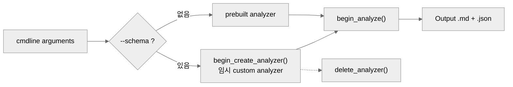

| 인자 | 기본값 | 설명 |
|---|---|---|
| `--endpoint` | (필수) | Foundry 계정 엔드포인트 |
| `--file` | (필수) | 분석할 문서, 여러 개면 반복 지정 |
| `--analyzer` | `prebuilt-document` | 이미 있는 analyzer id |
| `--schema` | — | fieldSchema JSON, 이 실행 동안만 쓸 custom analyzer 를 만듦 |
| `--processing-location` | 서비스 default (`global`) | `geography` · `dataZone` · `global` |
| `--out-dir` | 원본 문서 옆 | `.md` · `.json` 출력 디렉터리 |
| `--api-version` | `2025-11-01` | |

- `--analyzer` 와 `--schema` 는 **함께 쓸 수 없습니다** — 하나는 기존 analyzer 를 고르고, 다른 하나는 새로 만듭니다.
- `--schema` 로 만든 analyzer 는 `hol-cu-<random>` 이름으로 생겼다가 실행이 끝나면 지워집니다.
- 요약·필드 추출 계열 analyzer 는 계정에 모델 배포가 있어야 합니다. `--analyzer prebuilt-layout` 은 필요 없습니다.
- 같은 이름의 문서 둘을 한 번에 넘겨도 결과가 덮어써지지 않도록 `-2`, `-3` 접미사가 붙습니다.

```bash
# 기본 : prebuilt-document 로 markdown 뽑기
python hol-foundry-tools-content-understanding.py \
  --endpoint "<foundry-account-endpoint>" \
  --file "assets/agents/2026 휴식이 있는 캘린더.pdf" \
  --out-dir assets/tools

# 여러 문서 한 번에
python hol-foundry-tools-content-understanding.py \
  --endpoint "<foundry-account-endpoint>" \
  --file "assets/agents/KB주택시장리뷰_2025년 10월호.pdf" \
  --file "assets/agents/대한민국 헌법.pdf" \
  --out-dir assets/tools

# 필드 추출 : fieldSchema 로 custom analyzer 만들어 실행
python hol-foundry-tools-content-understanding.py \
  --endpoint "<foundry-account-endpoint>" \
  --schema schema.json \
  --file "assets/agents/하도급거래 공정화에 관한 법률(법률)(제21060호)(20251217).pdf"
```

`--schema` 로 넘기는 파일은 이런 모양입니다.

```json
{
  "name": "law-summary",
  "fields": {
    "Title": { "type": "string", "method": "extract", "description": "법령 제목" },
    "Summary": { "type": "string", "method": "generate", "description": "세 문장 요약" }
  }
}
```

---

### hol-foundry-tools-knowledge.py

Azure AI Search 인덱스(그리고 선택적으로 Bing)를 prompt agent 의 **지식**으로 선언합니다.
검색은 서비스가 project 연결을 통해 직접 수행하므로, 인덱스가 이 프로세스에서 보일 필요는 없습니다.

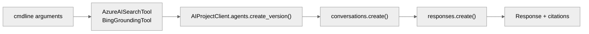

| 인자 | 기본값 | 설명 |
|---|---|---|
| `--endpoint` | (필수) | Foundry project 엔드포인트 |
| `--deployment` | `gpt-5.6-terra` | 모델 Deployment 이름 |
| `--index` | — | 근거로 삼을 Azure AI Search 인덱스 (`housing` · `merchants` · `news`) |
| `--search-connection` | project 의 기본 Search 연결 | Search 서비스로의 project connection 이름 |
| `--bing-connection` | — | Grounding with Bing Search 연결 이름, 공개 웹까지 함께 검색 |
| `--filter` | — | 모든 검색에 적용할 OData 필터, 예 `"category eq '기술'"` |
| `--agent-name` | `hol-knowledge-rag` | 버전을 만들 agent 이름 |
| `--question` | (필수) | 질문, 반복하면 같은 대화에서 이어 묻기 |
| `--show-sources` | 끔 | agent 가 돌린 검색과 인용을 그대로 출력 |
| `--delete` | 끔 | 끝나고 agent 삭제 |

- `--index` 와 `--bing-connection` 중 **최소 하나**는 있어야 합니다.
- 인덱스는 [`aisrch-init-upload-documents.py`](aisrch-init-upload-documents.py) 가 먼저 만들어 둔 것을 씁니다.
- 검색은 **project identity** 로 수행되므로, 내가 아니라 project 에 Search 서비스의 `Search Index Data Reader` 가 필요합니다.
- 쿼리 타입은 `semantic` 고정입니다. 랩 인덱스는 업로드 시점에 임베딩해 vectorizer 가 없으므로 vector 계열 쿼리는 오류가 납니다.
- 실행할 때마다 새 버전을 만듭니다 — 인덱스·필터가 정의의 일부라 바꿔 가며 비교하라는 뜻입니다.
- `--auth api-key` · `--auth access-token` 은 projects SDK 가 지원하지 않습니다.
- `--delete` 를 주지 않으면 agent 가 남으므로, 이어서 `hol-foundry-tools-voice.py --agent-name` 으로 같은 지식에 말로 물어볼 수 있습니다.

```bash
# 인덱스 하나로 묻기
python hol-foundry-tools-knowledge.py \
  --endpoint "<foundry-project-endpoint>" \
  --index housing \
  --question "2025년 10월 서울 아파트 매매가격 흐름을 요약해줘."

# 검색 과정까지 보기 + 이어 묻기
python hol-foundry-tools-knowledge.py \
  --endpoint "<foundry-project-endpoint>" \
  --index merchants \
  --show-sources \
  --question "서울 강남구 가맹점 수가 가장 많은 업종은?" \
  --question "그 근거가 된 레코드를 인용해줘."

# 인덱스 + 공개 웹, 그리고 정리
python hol-foundry-tools-knowledge.py \
  --endpoint "<foundry-project-endpoint>" \
  --index news \
  --bing-connection "<bing-connection-name>" \
  --filter "category eq '기술'" \
  --question "최근 기술 뉴스 흐름을 정리해줘." \
  --delete
```

---

### hol-foundry-tools-mcp.py

원격 MCP 서버를 prompt agent 의 **도구**로 선언합니다. 서버 호출도 서비스가 직접 하므로
이 프로세스에서 프록시되는 것은 없습니다.

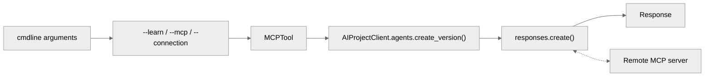

| 인자 | 기본값 | 설명 |
|---|---|---|
| `--endpoint` | (필수) | Foundry project 엔드포인트 |
| `--deployment` | `gpt-5.6-terra` | 모델 Deployment 이름 |
| `--learn` | 끔 | 공개 Microsoft Learn MCP 서버 붙이기 |
| `--mcp` | — | `LABEL=URL` 또는 `LABEL=URL=AUDIENCE`, 반복 가능 |
| `--connection` | — | `LABEL=CONNECTION_ID`, project 가 이미 가진 연결, 반복 가능 |
| `--allowed-tool` | — | 모든 서버를 이 이름의 도구로 제한, 반복 가능 |
| `--read-only` | 끔 | 서버가 read-only 로 표시한 도구만 허용 |
| `--agent-name` | `hol-mcp-ops` | 버전을 만들 agent 이름 |
| `--question` | (필수) | 질문, 반복하면 같은 대화에서 이어 묻기 |
| `--show-tools` | 끔 | 발견한 도구 목록과 호출 내역 출력 |
| `--delete` | 끔 | 끝나고 agent 삭제 |

- `--learn` · `--mcp` · `--connection` 중 **최소 하나**는 있어야 하고, 섞어 써도 됩니다.
- 인증 방식이 셋의 차이입니다 — `--learn` 은 공개·무인증, `--mcp` 의 `AUDIENCE` 는 **내 Entra 토큰**을 정의에 심어 두므로 토큰이 만료되면 그 버전은 동작을 멈추고, `--connection` 은 project identity 로 인증해 계속 동작합니다.
- 그래서 실행할 때마다 새 버전을 만듭니다.
- `--allowed-tool` 과 `--read-only` 는 함께 쓸 수 없습니다.
- 도구 호출 승인은 `never` 입니다 — 터미널에서 자문자답하는 랩에는 승인해 줄 사람이 없고, Learn 은 읽기 전용입니다.
- `--auth api-key` · `--auth access-token` 은 projects SDK 가 지원하지 않습니다.

```bash
# 가장 간단 : 공개 Learn MCP 서버
python hol-foundry-tools-mcp.py \
  --endpoint "<foundry-project-endpoint>" \
  --learn \
  --question "Azure Private Endpoint 와 Service Endpoint 차이를 문서 기준으로 알려줘."

# 도구 호출 과정까지 보기
python hol-foundry-tools-mcp.py \
  --endpoint "<foundry-project-endpoint>" \
  --learn --show-tools \
  --question "Foundry Agent Service 의 지원 리전을 알려줘."

# 다른 서버 함께 붙이기 + 읽기 전용 제한
python hol-foundry-tools-mcp.py \
  --endpoint "<foundry-project-endpoint>" \
  --learn \
  --mcp "myapi=https://<my-mcp-host>/mcp=https://<my-api-audience>" \
  --connection "internal=<project-connection-id>" \
  --read-only \
  --question "두 소스를 비교해서 정리해줘." \
  --delete
```

---

### hol-foundry-tools-voice.py

Voice Live API 로 **웹소켓 하나에 음성 입력과 음성 출력을 함께** 실어 대화합니다.
STT·TTS 를 따로 호출하는 [`hol-foundry-models-stt_tts.py`](#hol-foundry-models-stt_ttspy) 와 대비되는 경로입니다.

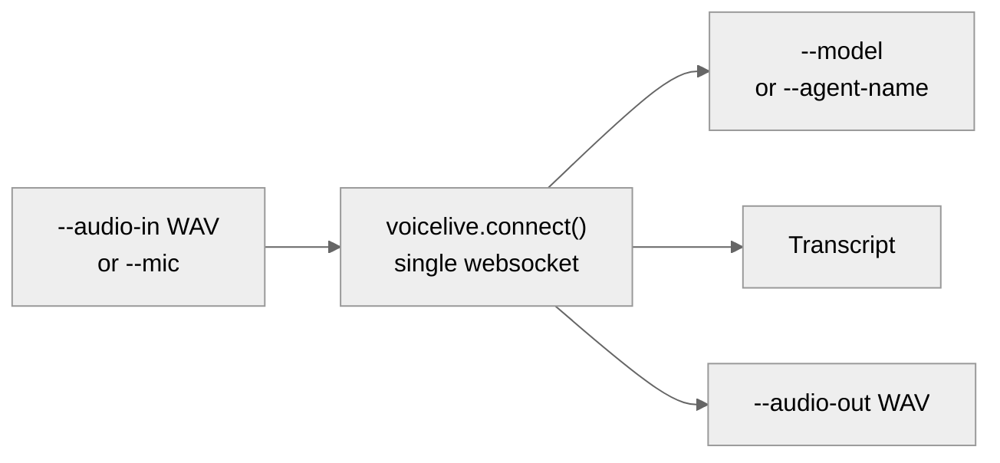

| 인자 | 기본값 | 설명 |
|---|---|---|
| `--endpoint` | (필수) | Foundry **계정** 엔드포인트 (`https://<resource>.cognitiveservices.azure.com`) |
| `--model` | `gpt-realtime` | 대화할 realtime 모델 |
| `--agent-name` | — | 모델 대신 Foundry agent 와 대화 (자체 instructions · 도구를 가져옴) |
| `--project-name` | — | `--agent-name` 이 있는 project |
| `--agent-version` | 최신 | `--agent-name` 의 버전 고정 |
| `--audio-in` | — | 말할 WAV 파일, 16-bit 모노 8/16/24 kHz |
| `--mic` | 끔 | Ctrl+C 까지 마이크로 말하기 |
| `--seconds` | — | `--mic` 를 N 초 뒤 종료 |
| `--audio-out` | `voice-out.wav` | 응답 음성 저장 위치 |
| `--voice` | `en-US-AvaMultilingualNeural` | Azure voice |
| `--language` | 자동 감지 | 입력 음성 언어, 예 `ko-KR` |
| `--instructions` | 랩 기본 프롬프트 | 어시스턴트 역할 재정의 |

- `--audio-in` 과 `--mic` 중 **정확히 하나**만 줍니다.
- `--agent-name` 과 `--project-name` 은 한 쌍이고, agent 가 이미 모델을 갖고 있으므로 `--model` 과는 함께 쓸 수 없습니다.
- `--agent-name` 을 쓰면 agent 의 instructions 를 덮어쓰지 않습니다 — `--instructions` 를 명시했을 때만 바뀝니다.
- `--mic` 는 `sounddevice` 패키지와 사운드카드가 필요합니다. Bastion 으로 접속한 점프박스라면 `--audio-in` 을 쓰세요.
- `--mic` 에서는 서비스가 VAD 로 턴을 끊고 barge-in(말 끊기)이 동작합니다. `--audio-in` 은 파일 전체가 한 턴입니다.
- 입력 WAV 형식이 맞지 않으면 전송 전에 멈추고 변환 명령을 알려 줍니다 — `ffmpeg -i in.wav -ac 1 -ar 24000 -sample_fmt s16 converted.wav`
- `--auth access-token` 은 Voice Live SDK 가 지원하지 않습니다.

```bash
# 파일로 한 번 말 걸기
python hol-foundry-tools-voice.py \
  --endpoint "<foundry-account-endpoint>" \
  --audio-in "assets/models/갤럭시Z 폴드8·플립8, 내일부터 사전 판매@2026.07.27.wav" \
  --language ko-KR \
  --audio-out voice-out.wav

# 마이크로 30초 대화
python hol-foundry-tools-voice.py \
  --endpoint "<foundry-account-endpoint>" \
  --mic --seconds 30

# knowledge 예제가 남긴 agent 에게 말로 묻기
python hol-foundry-tools-voice.py \
  --endpoint "<foundry-account-endpoint>" \
  --agent-name hol-knowledge-rag \
  --project-name "<project-name>" \
  --mic
```