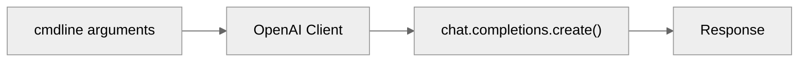
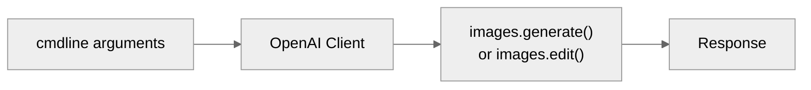
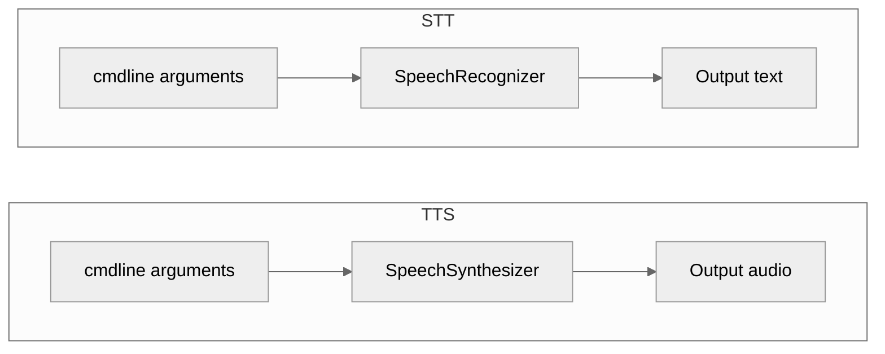
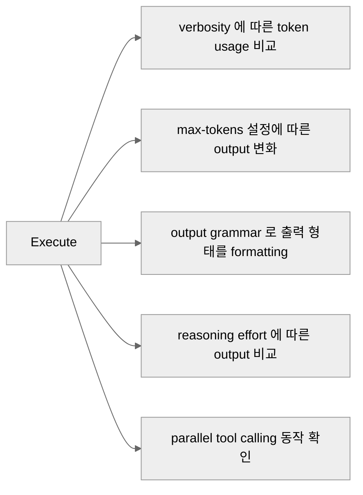
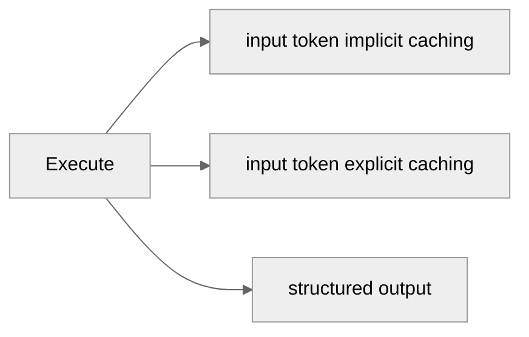
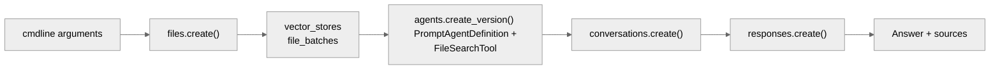
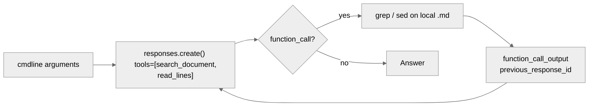
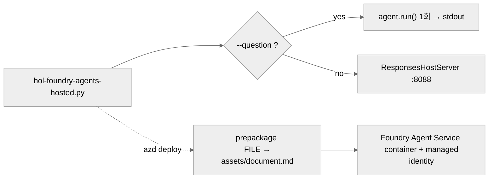

# Overview

Foundry 을 CLI에서 직접 호출해 보는 hands-on 스크립트 collection 입니다.

# Prerequisite
- Microsoft Foundry workspace ・ project ・ 모델 배포 완료
- 아래 명령어 실행하여 python package dependency resolve
  ```bash
  pip install -r requirements.txt
  az login
  ```

## 공통 인증

이 랩의 Foundry 계정은 키를 꺼 두었기 때문에(`disableLocalAuth=true`) 기본 경로는 Entra ID
토큰입니다. `az login`만 해 두면 아무 인증 인자도 줄 필요가 없습니다.
인증 코드는 [`identity.py`](identity.py) 한 곳에 있고, 아래 인자는 모든 스크립트가 공유합니다.

| 인자 | 기본값 | 설명 |
|---|---|---|
| `--auth` | `default` | `default` · `cli` · `device-code` · `environment` · `managed-identity` · `client-secret` · `client-certificate` · `api-key` · `access-token` |
| `--tenant-id` | `$AZURE_TENANT_ID` | 서비스 주체·디바이스 코드에서 사용 |
| `--client-id` | `$AZURE_CLIENT_ID` | 서비스 주체, 또는 사용자 할당 관리 ID |
| `--client-secret` | `$AZURE_CLIENT_SECRET` | `--auth client-secret` |
| `--certificate-path` | `$AZURE_CLIENT_CERTIFICATE_PATH` | `--auth client-certificate` |
| `--api-key` | `$AZURE_OPENAI_API_KEY` | 키를 끈 계정에서는 401 |
| `--access-token` | `$AZURE_OPENAI_ACCESS_TOKEN` | 이미 받아 둔 토큰 |

## Foundry Models
Foundry 의 **모델 호출(`hol-foundry-models-*.py`)** 을 다룹니다.

| File name | What to do |
|---|---|
| [`hol-foundry-models-llm.py`](#hol-foundry-models-llmpy) | LLM Q&A Pipeline |
| [`hol-foundry-models-optimize-reasoning.py`](#hol-foundry-models-optimize-reasoningpy) | LLM 추론·출력량 조절 옵션 비교 |
| [`hol-foundry-models-optimize-token.py`](#hol-foundry-models-optimize-tokenpy) | LLM 프롬프트 캐시와 구조화 출력으로 토큰 줄이기 |
| [`hol-foundry-models-vlm.py`](#hol-foundry-models-vlmpy) | Image 생성·편집 |
| [`hol-foundry-models-stt_tts.py`](#hol-foundry-models-stt_ttspy) | 음성 합성(TTS), 음성 인식(STT) |

### hol-foundry-models-llm.py

시스템 · 사용자 프롬프트를 보내고 응답을 받습니다.



| 인자 | 기본값 | 설명 |
|---|---|---|
| `--endpoint` | (필수) | Foundry Azure OpenAI 엔드포인트 |
| `--deployment` | `gpt-5.4` | 모델 Deployment 이름 |
| `--system` | `You are a helpful assistant.` | System 프롬프트 |
| `--user` | (필수) | User 프롬프트 |
| `--temperature` | 모델 default | |
| `--max-tokens` | 모델 default | |
| `--stream` | false | streaming 방식으로 token 수신 |

```bash
python hol-foundry-models-llm.py \
  --endpoint "<foundry-aoai-endpoint>" \
  --deployment "<model-deployment-name>" \
  --user "Azure Private Endpoint 를 세 문장으로 설명해줘."
```

---

### hol-foundry-models-vlm.py

텍스트 프롬프트와 이미지를 보내고 응답을 받습니다.



| 인자 | 기본값 | 설명 |
|---|---|---|
| `--endpoint` | (필수) | Foundry Azure OpenAI 엔드포인트 |
| `--deployment` | `gpt-image-2` | 모델 Deployment 이름 |
| `--method` | `generate` | `generate` 또는 `edit` |
| `--prompt` / `--prompt-file` | (둘 중 하나 필수) | 프롬프트를 직접 주거나 텍스트 파일에서 읽기 |
| `--image` | — | `--method edit`의 원본 이미지 |
| `--mask` | — | 교체할 영역을 표시한 PNG |
| `--out` | `image.png` | 출력 파일 |
| `--size` | `1024x1024` | |
| `--quality` | `low` | `low` · `medium` · `high` |
| `--count` | `1` | 받을 이미지 개수 |

```bash
# 생성 : 기본
python hol-foundry-models-vlm.py \
  --endpoint "<foundry-aoai-endpoint>" \
  --deployment "<model-deployment-name>" \
  --prompt "겨울 산 위의 데이터센터, 수채화" \
  --out datacenter.png

# 생성 : prompt 파일
python hol-foundry-models-vlm.py \
  --endpoint "<foundry-aoai-endpoint>" \
  --deployment "<model-deployment-name>" \
  --prompt-file assets/models/creative-01.txt \
  --quality high --count 2

# 편집
python hol-foundry-models-vlm.py \
  --endpoint "<foundry-aoai-endpoint>" \
  --deployment "<model-deployment-name>" \
  --method edit \
  --prompt-file assets/models/style-prompt.txt \
  --image assets/models/style-001.jpg
```

---

### hol-foundry-models-stt_tts.py

Azure Speech로 텍스트를 소리로(TTS), 소리를 텍스트로(STT) 바꿉니다.
`--tts-input`과 `--stt-input` 중 **정확히 하나**만 줍니다.



| 인자 | 기본값 | 설명 |
|---|---|---|
| `--endpoint` | (필수) | Foundry Speech 엔드포인트 |
| `--tts-input` | — | Text-to-Speech 입력 텍스트 |
| `--tts-output` | `speech.wav` | Text-to-Speech 출력 파일 |
| `--tts-voice` | `en-US-Ava:DragonHDLatestNeural` | voice 타입 |
| `--stt-input` | — | Speech-to-Text 입력 파일 |
| `--stt-lang` | `ko-KR` | Speech-to-Text 입력 언어 |
| `--stt-phrase` | — | 입력 단어 phrase list |
| `--stt-silence-ms` | SDK default | input 무음 구간 |
| `--stt-detailed` | 끔 | confidence 를 비롯한 세부사항을 출력 |
| `--stt-any-format` | 끔 | 16 kHz 모노가 아닌 파일도 그대로 전송 |
| `--no-post-refine` | 끔 | TrueText 후처리 끔 |

```bash
# STT — 한국어 음성으로
python hol-foundry-models-stt_tts.py \
  --endpoint "<foundry-aoai-endpoint>" \
  --stt-input "assets/models/갤럭시Z 폴드8·플립8, 내일부터 사전 판매@2026.07.27.wav"

# TTS — STT 로 출력된 텍스트 되받아 적기
python hol-foundry-models-stt_tts.py \
  --endpoint "<foundry-aoai-endpoint>" \
  --tts-input "..."
```

---

### hol-foundry-models-optimize-reasoning.py

Responses API의 조절 옵션을 하나씩 실행하고, 그때마다 `usage`를 찍어 줍니다.
무엇이 얼마나 토큰을 쓰는지 눈으로 보는 것이 목적입니다.



| 인자 | 기본값 | 설명 |
|---|---|---|
| `--endpoint` | (필수) | Foundry Azure OpenAI 엔드포인트 |
| `--deployment` | `gpt-5.4` | 모델 Deployment 이름 |
| `--demo` | `all` | `verbosity` · `max-tokens` · `cfg` · `reasoning` · `parallel-tools` · `all` |

```bash
# 다섯 개 전부
python hol-foundry-models-optimize-reasoning.py \
  --endpoint "<foundry-aoai-endpoint>" \
  --deployment "<model-deployment-name>"
```

---

### hol-foundry-models-optimize-token.py

프롬프트 캐시가 실제로 걸리는지, 그리고 구조화 출력이 모델마다 몇 토큰을 쓰는지 재 봅니다.



| 인자 | 기본값 | 설명 |
|---|---|---|
| `--endpoint` | (필수) | Foundry Azure OpenAI 엔드포인트 |
| `--deployment` | `gpt-5.4` | 모델 Deployment 이름 |
| `--demo` | `all` | `caching` · `cache-retention` · `cache-key` · `structured` · `all` |
| `--rounds` | `10` | input token caching 반복 횟수 |
| `--cache-key` | `prompt-cache-key-1` | 요청을 한 엔드포인트에 붙여 두는 키 |
| `--structured-deployments` | `gpt-4.1 gpt-5.4` | 같은 구조화 출력으로 비교할 모델 Deployment 들 |

```bash
# 전부
python hol-foundry-models-optimize-token.py \
  --endpoint "<foundry-aoai-endpoint>" \
  --deployment "<model-deployment-name>"
```

## Foundry Agents
Foundry 의 **에이전트(`hol-foundry-agents-*.py`)** 를 다룹니다.
세 스크립트 모두 **markdown 문서 하나를 근거로 답하는 같은 RAG 에이전트**이고,
에이전트가 *어디에 사는지* 만 다릅니다.

| File name | What to do |
|---|---|
| [`hol-foundry-agents-prompt.py`](#hol-foundry-agents-promptpy) | Foundry 에 선언형 prompt agent 를 만들고 File Search 로 답하기 |
| [`hol-foundry-agents-responses.py`](#hol-foundry-agents-responsespy) | Responses API + function calling 으로 프로세스 안에서만 사는 agent |
| [`hol-foundry-agents-hosted.py`](#hol-foundry-agents-hostedpy) | Agent Framework 로 만든 agent 를 Foundry Agent Service 에 배포 |

| | prompt | responses | hosted |
|---|---|---|---|
| 에이전트가 사는 곳 | Foundry (영속) | 이 프로세스 (일회성) | Foundry Agent Service (컨테이너) |
| 검색 방식 | File Search (vector store) | `grep` · `sed` (line 번호 인용) | `grep` · `sed` (line 번호 인용) |
| 도구 실행 위치 | 서비스 | 내 PC | 컨테이너 |
| 남는 리소스 | agent · vector store · file | 없음 | azd 가 만든 agent · 컨테이너 |
| 필요한 준비 | embedding deployment | 없음 | `azd`, `microsoft.foundry` extension |

입력 markdown 은 [`hol-foundry-tools-content-understanding.py`](hol-foundry-tools-content-understanding.py) 가
PDF 에서 뽑아 놓은 `.md` 를 그대로 쓰면 됩니다. (예: `assets/tools/KB주택시장리뷰_2025년 10월호.md`)

### hol-foundry-agents-prompt.py

문서를 업로드해 vector store 로 색인하고, 그 위에 prompt agent 를 선언합니다.
검색도 응답도 전부 서비스에서 일어나므로 이 프로세스는 질문만 던집니다.



| 인자 | 기본값 | 설명 |
|---|---|---|
| `--endpoint` | (필수) | Foundry **project** 엔드포인트 (`https://<resource>.ai.azure.com/api/projects/<project>`) |
| `--deployment` | `gpt-5.6-terra` | 모델 Deployment 이름 |
| `--file` | — | 업로드할 markdown. **agent 가 아직 없을 때만** 필요 |
| `--agent-name` | `hol-md-rag` | 재사용하거나 새로 만들 agent 이름 |
| `--question` | (필수) | 질문. 여러 번 주면 같은 conversation 에서 이어서 물음 |
| `--delete` | 끔 | 끝나고 agent · vector store · file 까지 정리 |

- `--auth api-key` 와 `--auth access-token` 은 projects SDK 가 받지 않습니다. Entra ID 경로를 쓰세요.
- vector store 색인에는 계정에 **embedding deployment** 가 있어야 합니다.
- 실행 중 실패하면 *이번 실행이 만든 것만* 되돌립니다. 재사용한 agent 는 건드리지 않습니다.

```bash
# 최초 실행 : 문서를 올리며 agent 생성
python hol-foundry-agents-prompt.py \
  --endpoint "<foundry-project-endpoint>" \
  --file "assets/tools/KB주택시장리뷰_2025년 10월호.md" \
  --question "2025년 10월 서울 아파트 매매가격 흐름을 요약해줘."

# 재사용 : --file 없이, 이어서 두 번 묻기
python hol-foundry-agents-prompt.py \
  --endpoint "<foundry-project-endpoint>" \
  --question "전세 시장은 어땠어?" \
  --question "그 근거가 된 문장을 그대로 인용해줘."

# 정리 : agent · vector store · file 삭제
python hol-foundry-agents-prompt.py \
  --endpoint "<foundry-project-endpoint>" \
  --question "마지막 질문" \
  --delete
```

---

### hol-foundry-agents-responses.py

Foundry 에는 아무것도 만들지 않습니다. 모델이 `search_document` · `read_lines` 를 호출하면
이 프로세스가 `grep` · `sed` 로 로컬 파일을 읽어 결과를 돌려주는 tool loop 를 직접 돌립니다.
vector store 가 없으니 embedding deployment 도, 색인 동기화도 필요 없습니다.



| 인자 | 기본값 | 설명 |
|---|---|---|
| `--endpoint` | (필수) | Foundry 계정 또는 project 엔드포인트 |
| `--deployment` | `gpt-5.6-terra` | 모델 Deployment 이름 |
| `--file` | (필수) | 검색할 로컬 markdown |
| `--question` | (필수) | 질문 (한 번) |
| `--show-tools` | 끔 | 모델이 돌린 검색을 그대로 출력 |

- tool loop 는 최대 8 라운드입니다. 넘으면 질문을 좁히라는 메시지와 함께 종료합니다.
- `subprocess` 를 shell 없이 실행하므로 모델이 만든 패턴이 다른 명령으로 번지지 않습니다.

```bash
# 기본
python hol-foundry-agents-responses.py \
  --endpoint "<foundry-aoai-endpoint>" \
  --file "assets/tools/KB주택시장리뷰_2025년 10월호.md" \
  --question "월세 지수는 어떻게 움직였어?"

# 에이전트가 어떤 검색을 돌리는지 같이 보기
python hol-foundry-agents-responses.py \
  --endpoint "<foundry-aoai-endpoint>" \
  --file "assets/tools/KB주택시장리뷰_2025년 10월호.md" \
  --question "지방 시장과 수도권을 비교해줘." \
  --show-tools
```

---

### hol-foundry-agents-hosted.py

앞의 responses 예제와 같은 도구를 Agent Framework 의 `Agent` 로 감싼 것입니다.
파일 하나가 두 가지로 동작합니다 — `--question` 을 주면 한 번 답하고 끝나고,
주지 않으면 responses 프로토콜을 서빙합니다. Foundry 는 이 서빙 경로로 에이전트를 호출합니다.



| 인자 | 기본값 | 설명 |
|---|---|---|
| `--endpoint` | `$FOUNDRY_PROJECT_ENDPOINT` · `$AZURE_AI_PROJECT_ENDPOINT` | Foundry project 엔드포인트 |
| `--deployment` | `$FOUNDRY_MODEL_NAME` · `$AZURE_AI_MODEL_DEPLOYMENT_NAME` · `gpt-5.6-terra` | 모델 Deployment 이름 |
| `--file` | `$AGENT_DOCUMENT` | 검색할 markdown. 없으면 스크립트 옆에서도 찾아봄 |
| `--question` | — | 주면 한 번 답하고 종료, 없으면 서버로 동작 |
| `--port` | `$PORT` · `8088` | 서빙 포트 |
| `--host` | `0.0.0.0` | bind 주소 (호스팅될 때 `0.0.0.0`) |

배포에 필요한 것들은 [`azure.yaml`](azure.yaml) · [`.agentignore`](.agentignore) · [`Makefile`](Makefile) 에 있습니다.
Foundry project 와 모델 배포는 `iac/` 가 만들고, azd 는 **에이전트만** 빌드·호스팅합니다.
`.agentignore` 덕분에 ZIP 에는 `hol-foundry-agents-hosted.py` · `identity.py` · `requirements.txt` ·
`assets/document.md` 네 개만 올라갑니다.

```bash
# 사전 준비
az login && azd auth login
azd ext install microsoft.foundry
export AZURE_AI_PROJECT_ENDPOINT="<foundry-project-endpoint>"
export AZURE_AI_MODEL_DEPLOYMENT_NAME="<model-deployment-name>"
```

| Makefile target | 하는 일 |
|---|---|
| `make ask-local FILE=… QUESTION=…` | 컨테이너와 같은 코드 경로로 한 번만 답하기 (서버 없음) |
| `make local FILE=…` | `localhost:8088` 에 서빙, 배포는 하지 않음 |
| `make ask FILE=… QUESTION=…` | 같은 문서를 responses 예제로 물어보기 |
| `make stage FILE=…` | `assets/document.md` 로 staging 하고 실제 업로드 목록 확인 |
| `make provision` | 기존 project 위에 azd 환경 생성 |
| `make deploy FILE=…` | 패키징해서 Foundry Agent Service 에 배포 |
| `make invoke QUESTION=…` | 배포된 에이전트에 질문 |
| `make monitor` | 호스팅된 컨테이너 로그 따라가기 |
| `make down` | azd 가 만든 것 제거 |

```bash
# 배포 전에 로컬에서 도구가 도는지부터 확인
make ask-local FILE="assets/tools/KB주택시장리뷰_2025년 10월호.md" \
  QUESTION="이 문서는 무엇에 대한 것인가요?"

# 배포하고 물어보기
make deploy FILE="assets/tools/KB주택시장리뷰_2025년 10월호.md"
make invoke QUESTION="2025년 10월 전세 시장을 요약해줘."

# 스크립트를 직접 서빙 (Makefile 없이)
python hol-foundry-agents-hosted.py \
  --endpoint "<foundry-project-endpoint>" \
  --file "assets/tools/KB주택시장리뷰_2025년 10월호.md" \
  --port 8088
```