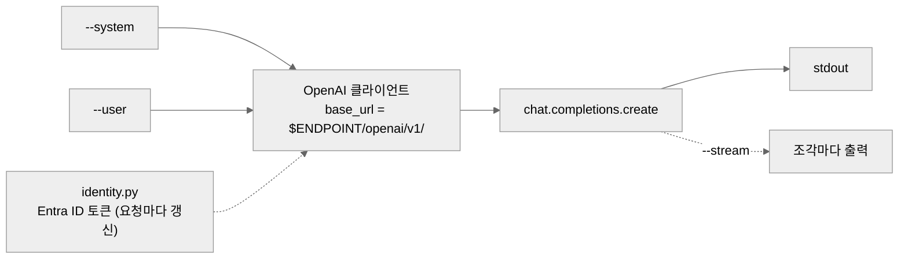
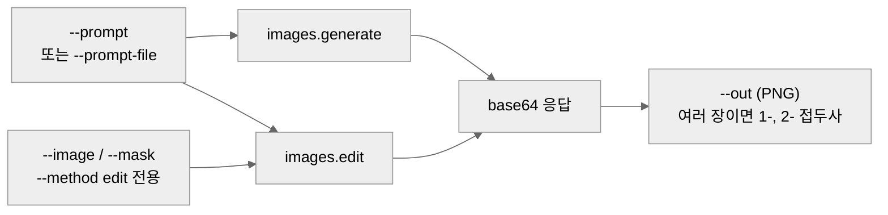
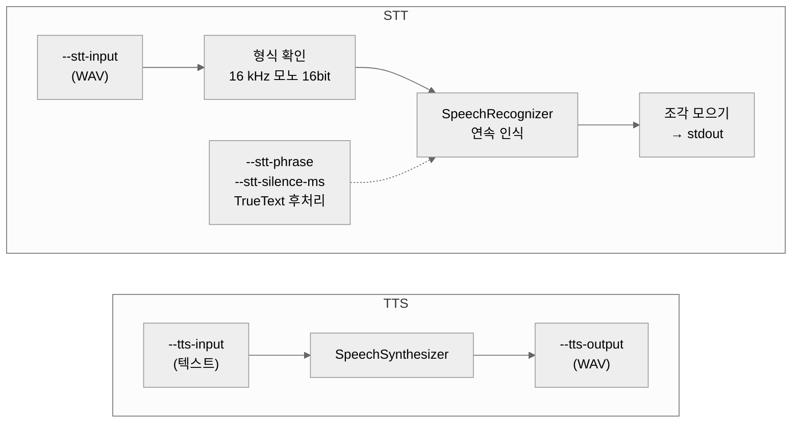
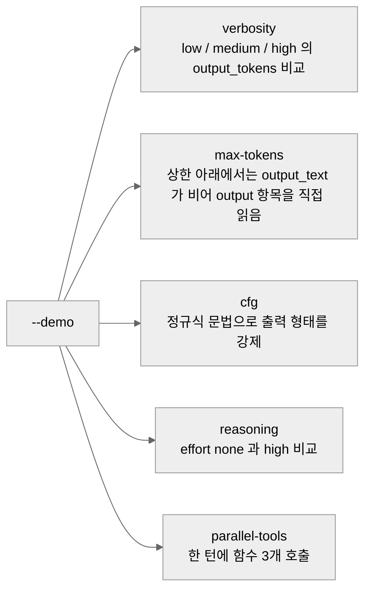
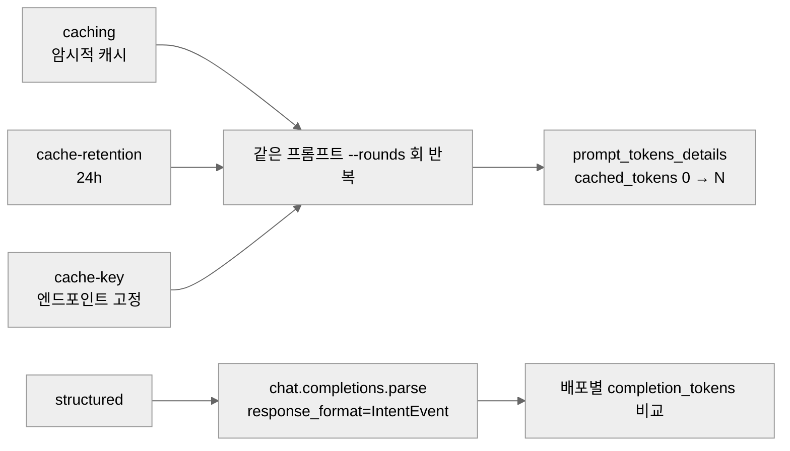

# python/

Foundry에 배포된 모델을 CLI에서 직접 호출해 보는 스크립트 모음입니다.
노트북 대신 스크립트를 쓰는 이유는, 점프박스에서 그대로 실행해 보기 위해서입니다.

이 문서는 우선 **모델 호출(`hol-foundry-models-*.py`)** 다섯 개를 다룹니다.

| 스크립트 | 하는 일 |
|---|---|
| [`hol-foundry-models-llm.py`](#hol-foundry-models-llmpy) | 채팅 한 번 주고받기, 스트리밍 |
| [`hol-foundry-models-vlm.py`](#hol-foundry-models-vlmpy) | 이미지 생성·편집 |
| [`hol-foundry-models-stt_tts.py`](#hol-foundry-models-stt_ttspy) | 음성 합성(TTS), 음성 인식(STT) |
| [`hol-foundry-models-optimize-reasoning.py`](#hol-foundry-models-optimize-reasoningpy) | 추론·출력량 조절 옵션 비교 |
| [`hol-foundry-models-optimize-token.py`](#hol-foundry-models-optimize-tokenpy) | 프롬프트 캐시와 구조화 출력으로 토큰 줄이기 |

## 준비

```bash
pip install -r requirements.txt
az login

export ENDPOINT=https://<리소스>.cognitiveservices.azure.com
```

`--endpoint`는 **Foundry 계정 엔드포인트**입니다. 프로젝트 엔드포인트(`.../api/projects/...`)가
아닙니다.

## 공통 인증

이 랩의 Foundry 계정은 키를 꺼 두었기 때문에(`disableLocalAuth=true`) 기본 경로는 Entra ID
토큰입니다. `az login`만 해 두면 아무 인증 인자도 줄 필요가 없습니다.
인증 코드는 [`identity.py`](identity.py) 한 곳에 있고, 아래 인자는 모든 스크립트가 공유합니다.

| 인자 | 기본값 | 설명 |
|---|---|---|
| `--auth` | `default` | `default` · `cli` · `device-code` · `environment` · `managed-identity` · `client-secret` · `client-certificate` · `api-key` · `access-token` |
| `--tenant-id` | `$AZURE_TENANT_ID` | 서비스 주체·디바이스 코드에서 사용 |
| `--client-id` | `$AZURE_CLIENT_ID` | 서비스 주체, 또는 사용자 할당 관리 ID |
| `--client-secret` | `$AZURE_CLIENT_SECRET` | `--auth client-secret` |
| `--certificate-path` | `$AZURE_CLIENT_CERTIFICATE_PATH` | `--auth client-certificate` |
| `--api-key` | `$AZURE_OPENAI_API_KEY` | 키를 끈 계정에서는 401 |
| `--access-token` | `$AZURE_OPENAI_ACCESS_TOKEN` | 이미 받아 둔 토큰 |

브라우저가 없는 점프박스에서는 `--auth device-code`, VM의 관리 ID로 호출하려면
`--auth managed-identity`를 씁니다.

토큰 범위는 v1 API용인 `https://ai.azure.com/.default`입니다. 401이 나면
`identity.py`의 `SCOPE`를 예전 데이터 평면 범위로 되돌려 보세요.

---

## hol-foundry-models-llm.py

시스템·사용자 프롬프트를 한 번 보내고 답을 받습니다.



`AzureOpenAI` 클라이언트도, `api_version`도 쓰지 않습니다. v1 API는 표준 `OpenAI` 클라이언트에
`base_url`만 Foundry로 돌려주면 됩니다. `api_key`에 함수를 넘기면 SDK가 요청할 때마다 호출해
토큰을 새로 받습니다.

| 인자 | 기본값 | 설명 |
|---|---|---|
| `--endpoint` | (필수) | Foundry 계정 엔드포인트 |
| `--deployment` | `gpt-5.4` | 모델 배포 이름 |
| `--system` | `You are a helpful assistant.` | 시스템 프롬프트 |
| `--user` | (필수) | 사용자 프롬프트 |
| `--temperature` | 모델 기본값 | |
| `--max-tokens` | 모델 기본값 | 최신 모델은 `max_completion_tokens`로 전달됩니다 |
| `--stream` | 끔 | 토큰이 오는 대로 출력 |

```bash
# 가장 짧은 호출
python hol-foundry-models-llm.py --endpoint $ENDPOINT \
  --user "Azure Private Endpoint 를 세 문장으로 설명해줘."

# 배포 이름과 시스템 프롬프트를 지정하고, 스트리밍으로
python hol-foundry-models-llm.py --endpoint $ENDPOINT \
  --deployment gpt-5.4-mini \
  --system "너는 네트워크 엔지니어야. 짧게 답해." \
  --user "NSG 와 Azure Firewall 의 차이는?" \
  --stream

# 점프박스에서 (브라우저 없음)
python hol-foundry-models-llm.py --endpoint $ENDPOINT --auth device-code \
  --user "지금 이 호출은 Private Endpoint 를 통해 들어왔을까?"
```

---

## hol-foundry-models-vlm.py

`gpt-image` 계열로 이미지를 만들거나 고칩니다.



`--mask`는 `--image`에서 **바꿀 영역**을 표시한 PNG입니다(투명한 부분이 교체 대상).
`gpt-image` 계열은 URL을 주지 않고 항상 base64로 돌려주므로, 스크립트가 파일로 저장합니다.
`--count`가 2 이상이면 두 번째부터 `1-`, `2-` 접두사가 붙습니다.

| 인자 | 기본값 | 설명 |
|---|---|---|
| `--endpoint` | (필수) | Foundry 계정 엔드포인트 |
| `--deployment` | `gpt-image-2` | 모델 배포 이름 |
| `--method` | `generate` | `generate` 또는 `edit` |
| `--prompt` / `--prompt-file` | (둘 중 하나 필수) | 프롬프트를 직접 주거나 텍스트 파일에서 읽기 |
| `--image` | — | `--method edit`의 원본 이미지 |
| `--mask` | — | 교체할 영역을 표시한 PNG |
| `--out` | `image.png` | 출력 파일 |
| `--size` | `1024x1024` | |
| `--quality` | `low` | `low` · `medium` · `high` |
| `--count` | `1` | 받을 이미지 개수 |

```bash
# 생성
python hol-foundry-models-vlm.py --endpoint $ENDPOINT \
  --prompt "겨울 산 위의 데이터센터, 수채화" --out datacenter.png

# 긴 프롬프트는 파일로
python hol-foundry-models-vlm.py --endpoint $ENDPOINT \
  --prompt-file assets/prompt.txt --quality high --count 2

# 편집 — 마스크로 표시한 영역만 바꾸기
python hol-foundry-models-vlm.py --endpoint $ENDPOINT --method edit \
  --image datacenter.png --mask sky-mask.png \
  --prompt "하늘을 밤하늘로" --out datacenter-night.png
```

---

## hol-foundry-models-stt_tts.py

Azure Speech로 텍스트를 소리로(TTS), 소리를 텍스트로(STT) 바꿉니다.
`--tts-input`과 `--stt-input` 중 **정확히 하나**만 줍니다.



인식은 `recognize_once`가 아니라 **연속 인식**입니다. `recognize_once`는 첫 발화 하나만 듣고
끝나서, 몇 초를 넘는 파일은 대부분이 조용히 버려집니다.

입력 형식이 16 kHz 모노 16bit가 아니면 **변환 명령을 알려 주고 멈춥니다.** 몰래 변환하지 않는
이유는, 변환했다는 사실 자체가 인식 결과를 해석할 때 필요한 정보이기 때문입니다.
그대로 보내려면 `--stt-any-format`을 줍니다.

Speech SDK는 자격 증명 객체를 직접 받아 토큰을 스스로 가져오므로 `--auth access-token`은
지원하지 않습니다.

| 인자 | 기본값 | 설명 |
|---|---|---|
| `--endpoint` | (필수) | Foundry 계정 엔드포인트(사용자 지정 도메인) |
| `--tts-input` | — | 합성할 텍스트 |
| `--tts-output` | `speech.wav` | 합성 결과 파일 |
| `--tts-voice` | `en-US-Ava:DragonHDLatestNeural` | 예: `ko-KR-SunHiNeural` |
| `--stt-input` | — | 인식할 오디오 파일 |
| `--stt-lang` | `ko-KR` | 인식 언어 |
| `--stt-phrase` | — | 나올 법한 말을 미리 알려 줌. **반복 지정 가능**, 고유명사에 효과가 가장 큼 |
| `--stt-silence-ms` | SDK 기본값 | 이만큼 조용하면 한 문장이 끝난 것으로 봄. 문장이 잘게 쪼개지면 늘림 |
| `--no-post-refine` | 끔 | TrueText 후처리(문장 부호·숫자 표기 정리)를 끔 |
| `--stt-detailed` | 끔 | 후보와 신뢰도를 함께 출력 |
| `--stt-any-format` | 끔 | 16 kHz 모노가 아닌 파일도 그대로 전송 |

```bash
# TTS — 한국어 음성으로
python hol-foundry-models-stt_tts.py --endpoint $ENDPOINT \
  --tts-input "프라이빗 엔드포인트를 통해 호출했습니다." \
  --tts-voice ko-KR-SunHiNeural --tts-output hello.wav

# STT — 방금 만든 파일을 되받아 적기
python hol-foundry-models-stt_tts.py --endpoint $ENDPOINT --stt-input hello.wav

# 형식 맞추기
ffmpeg -i meeting.m4a -ac 1 -ar 16000 -sample_fmt s16 meeting.wav

# 고유명사를 미리 알려 주고, 후보와 신뢰도까지 확인
python hol-foundry-models-stt_tts.py --endpoint $ENDPOINT --stt-input meeting.wav \
  --stt-phrase "프라이빗 엔드포인트" --stt-phrase "Azure Firewall" \
  --stt-silence-ms 1200 --stt-detailed
```

---

## hol-foundry-models-optimize-reasoning.py

Responses API의 조절 옵션을 하나씩 실행하고, 그때마다 `usage`를 찍어 줍니다.
무엇이 얼마나 토큰을 쓰는지 눈으로 보는 것이 목적입니다.



| 인자 | 기본값 | 설명 |
|---|---|---|
| `--endpoint` | (필수) | Foundry 계정 엔드포인트 |
| `--deployment` | `gpt-5.4` | 모델 배포 이름 |
| `--demo` | `all` | `verbosity` · `max-tokens` · `cfg` · `reasoning` · `parallel-tools` · `all` |

```bash
# 다섯 개 전부
python hol-foundry-models-optimize-reasoning.py --endpoint $ENDPOINT

# 하나만 — 추론 예산을 바꿔 가며 같은 퀴즈 풀리기
python hol-foundry-models-optimize-reasoning.py --endpoint $ENDPOINT --demo reasoning

# 출력량 옵션만
python hol-foundry-models-optimize-reasoning.py --endpoint $ENDPOINT \
  --deployment gpt-5.4-mini --demo verbosity
```

---

## hol-foundry-models-optimize-token.py

프롬프트 캐시가 실제로 걸리는지, 그리고 구조화 출력이 모델마다 몇 토큰을 쓰는지 재 봅니다.



캐시는 프롬프트 앞 1,024 토큰이 완전히 같아야 걸립니다. 그래서 데모마다 **첫 줄을 다르게 두고**
각자 자기 캐시를 만듭니다. 프롬프트를 공유하면 첫 데모가 나머지 캐시까지 데워 놓아서,
무엇을 설정하든 전부 적중으로 보이게 됩니다.

- `caching` — 암시적 캐시. 서빙 엔드포인트 메모리에 있고 5~10분 놀면 지워집니다.
- `cache-retention` — `prompt_cache_retention="24h"`. 같은 캐시를 GPU 스토리지로 내려 최대 24시간.
- `cache-key` — 배포는 여러 엔드포인트에 퍼져 있고 캐시는 그중 하나에만 있습니다.
  키가 같은 요청을 같은 엔드포인트로 보내 적중률을 올립니다.

| 인자 | 기본값 | 설명 |
|---|---|---|
| `--endpoint` | (필수) | Foundry 계정 엔드포인트 |
| `--deployment` | `gpt-5.4` | 캐시 데모가 쓰는 배포 |
| `--demo` | `all` | `caching` · `cache-retention` · `cache-key` · `structured` · `all` |
| `--rounds` | `10` | 같은 호출을 몇 번 반복할지 |
| `--cache-key` | `prompt-cache-key-1` | 요청을 한 엔드포인트에 붙여 두는 키 |
| `--structured-deployments` | `gpt-4.1 gpt-5.4` | 같은 구조화 출력으로 비교할 배포들 |

```bash
# 전부
python hol-foundry-models-optimize-token.py --endpoint $ENDPOINT

# 암시적 캐시만, 3번씩
python hol-foundry-models-optimize-token.py --endpoint $ENDPOINT --demo caching --rounds 3

# 캐시 키를 바꿔 가며 적중률 비교
python hol-foundry-models-optimize-token.py --endpoint $ENDPOINT \
  --demo cache-key --cache-key team-a --rounds 5

# 구조화 출력 — 실제 배포한 이름으로 바꿔서
python hol-foundry-models-optimize-token.py --endpoint $ENDPOINT \
  --demo structured --structured-deployments gpt-5.4-mini gpt-5.4
```

## 자주 걸리는 것

- **`DeploymentNotFound`** — `--deployment` 기본값은 `gpt-5.4`입니다. 실제 배포 이름은
  `az cognitiveservices account deployment list -n <계정> -g <리소스그룹> -o table`로 확인하세요.
  이 랩의 기본 배포 모델은 `gpt-5.4-mini`입니다.
- **`401`** — `az login`을 했어도 Foundry 데이터 평면 역할(예: Azure AI User)이 없으면 거부됩니다.
- **연결 자체가 안 됨** — private 시스템의 Foundry는 공용 접근이 닫혀 있습니다. 점프박스에서
  실행해야 합니다.
